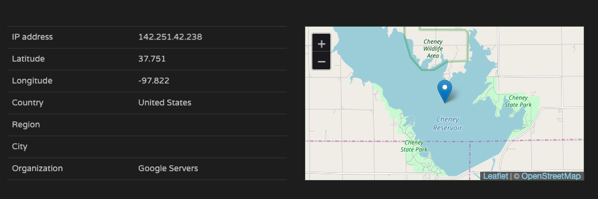

# 企業資料通訊作業二
109306058 資管三 康瑋翔

## Q1:
> 在P2P的結構中，兩個人皆有互相傳送檔案的機會，而在普通的家中網路ADSL和Cable Server時，下載的流量通常比上傳多很多，因此有可能對方想要用P2P下載你的檔案，但你上傳的速度遠遠不及它，因此會把上傳的流量吃滿，造成網路壅塞。
## Q2:
### 2-1
> HTTP /1.1
### 2-2
在request和responce中的connection欄位裡，都寫著keep-alive，因此這是一個persistent connection.ß
### 2-3
> 9
> 1. test
> 2. html,application 
> 3. xhtml+xml,application 
> 4. xml;q=0.9,image 
> 5. avif,image 
> 6. webp,image 
> 7. apng 
> 8. */ *'q = 0.8,application
> 9. signed-exchange;v=b3;q=0.9
### 2-4
> https://abc.com/
### 2-5
q value代表的是使用者的接受偏好，越靠近1代表使用者越喜歡，因此可以看見這位使用者叫喜歡繁體中文作為他的使用語言。

## Q3: 
### 3-1
因為公司內部可能為了分流架設了四個伺服器（並且擁有不同的ip位置），但是他們四個伺服器對外共用同一個domain name，因此最後得到了四個不一樣的ip位置，而最後作業系統會幫我們隨機挑一個。
### 3-2
應該是by local DNS server，因為在response中的Authorrity RRs標記的是0。ß
### 3-3
系統會隨機挑一個
## Q4: 
### 4-1
可以從response中看見youtube內部真實的網址其實是youtube-ui.l.google.com，因此為了讓query知道真實的domain name，他使用了cname。
### 4-2

用網路上的IP location，可以直接看出來兩個IP都在美國

而直接用traceroute來看，可以看見，兩個的路徑都有經過幾個共同的路徑，例如:72.14.202.60, 142.251.\*.\*
### 4-3
使用cname可以讓自訂domain name有更大的彈性，可以在公司內部裡面設定不同的domain name方便管理，而網站使用者又可以只用同一個domain name管理就好，但是整個呼叫的過程就多了cname的這個程序，可能會使DNS多一些些負擔。

