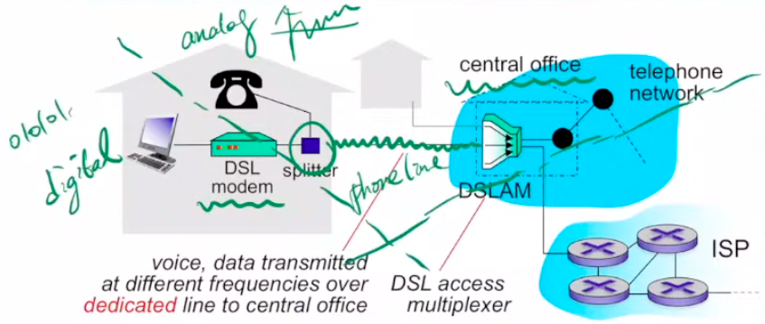
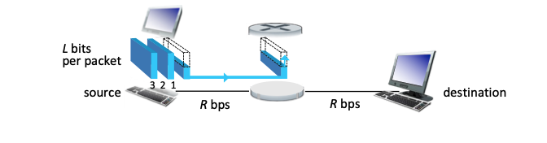
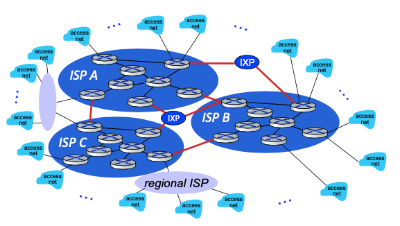
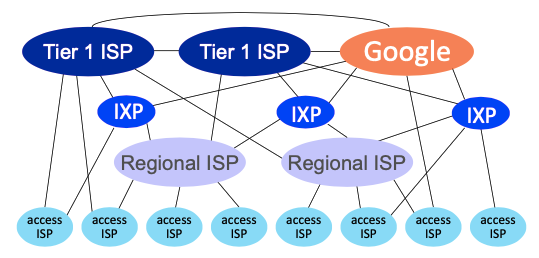

# Chpater 1 Computer Networks and the Internet

## 1.1 What Is the Internet?

網路簡單來說就是大家在交換資料，而想要交換資料的人稱為Network Edge，例如：電腦、伺服器，而協助資料傳來傳去的硬體、軟體、設定則稱為Network Core。

其他常聽到的名詞
* Internet Service Provider：提供網路服務的公司
* Internet Standards：因為大家要送資料，所以要統一格式
* IETF:Internet Engineering Task Force，幫忙統一格式的組織
* RFCs:訂定網路格式的文件

## 1.2 The Network Edge

Edge之中最重要的就是家中網路，以下有幾種家裡可以收到網路的方法

在這之前先介紹一些名詞
* Splitter: 在家的裡面，把一條線上的訊號分給電話和網路 （把數位和類比分開）
* DSL modem: 讓你可以上網的小烏龜
* CO(local central offic)
* DSLAM：在CO裡面分開數位訊號和類比訊號 (digital subscriber line access multiplexer)
   

**DSL(digital subscriber line)** 

簡單來說就是把電話線的一部份拿來傳送網路，而因此有一些特性
* 一家人有獨立一條（不然講電話隔壁也聽的到內容）
* 因應資料量不同用不同的頻率，資料量越大頻率越高
* 資料量排名：電話(0 - 4 kHz) < 上傳(4 - 50 KHz) < 下載(50 KHz - 1MHz)
* ADSL實際上很慢，因此實際在台灣運作的是VDSL，也就是用兩條電話線一起來傳資料。 

**Cable Internet Access**

簡單來說就是用電視業者傳送電視影像的線，送網路給大家，也因為電視的特性，在一個區域內的住戶，在某一段的時候會共用一條線（因為電視同一台畫面都一樣）

以下是一些補充
* HFC(Hybrid fiber coax):光纖同軸電纜，cable用的線
* CMTS(cable modem termination system):把上傳和下載分開 

**FTTH(fiber to the home)**

年輕人的新玩具，就拉一條光纖網路線沒在跟你五四三

**企業網路**
企業網路

資料要從Edge送到另一個Edge需要媒介，可以分為固體的和無線的，補充在下面。
## 1.3 The Network Core

最重要的兩個功能：
1. Routing : 決定資料該走什麼路線抵達終點
2. Forwarding：就是在資料轉換(switching)

**送封包的方式**

1. packet switching  
是目前網路上真的使用的方法，想像兩個host中間有一個router，一個封包「完整的」的抵達Router之後，封包才會「開始」往下一個地點出發。  其中還有一個機制**Queueing** 也就是每個Router裡面都有容量限制，封包在Router裡面就像在排隊，因此就做queue（從Router裡面準備被送出去的封包)  而傳輸速率，因為要等一個封包完整的傳送完成，假如總資料有L大小，傳送的速度是R，每當有一個中繼站的時候，就會多出L/R的時間，而這樣的送法叫做store-and-forward.

2. circuit switching 
可以想像成，在sender和receiver之間建立了一個通道，這個通道就是你們佔有的，因此資料傳輸的時間就是封包大小/傳輸速率，不會有中繼站變慢的問題。

而一條網路線上，可以讓多個使用者都開通道，那要怎麼分配一條網路線的資源有兩種方法

1. FDM(Frequency Division Multiplexing)
2. TDM(Time Division Multiplexing)

**Packet Switching v.s. Circuit Switching**

| Packet Switching | Circuit Switching|
|----|----|
|better sharing of transmission capacity|less delay|
|efficient and less costly||
|more user in a time||

**Network of Network**

在前面有提到ISP是提供網路的業者，那ISP有哪些分類？這就要從幾個假設開始說起。

而以下的假設要從讓「全球的使用者」都有網路可以互通

1. Network Structure 1
    * 只有一個Global ISP，提供服務
2. Network Structure 2
    * 假設Structure 1 的ISP可以賺錢，那自然會有其他公司也想做Global ISP，因此會有多家業者一起做Global ISP是正常的
    * 為了讓全球使用者互通，ISP之間互相溝通是必須的 
3. Network Structure 3
    * 在現實，有些小地方可能沒有網路連接，因此有地方業者（Regional ISP）去建立網路，並且向Global ISP(T1 ISP)溝通。
    * 當然，更實際的情況是Regional ISP 有大有小，這樣的現象稱為multi-tier hierarchy。
4. Network Structure 4
    * 由於出現了多重結構，假如網路傳輸都要一層一層傳送到T1 ISP，那全球網路會超級慢，因此下了以下的機制協助上下左右溝通更快
    * IXP:讓Global ISP互相交換資料的東西(Internet exchange point)
    * Peering link: 讓其中一些Router可以跟其他人連接
    * PoP(points of presence) is simply a group of one or more routers (at the same location) in the provider's network where customer ISPs can connect into the provider ISP.
    
5. Network Structure 5
    * 考量到有些提供大量網路服務資料的公司，他們自己會跟ISP建立一個屬於自己的網路e.g. Google

## 1.4 Delay, Loss, and Throughput in Packet-Switched Networks

### Types of Delay

1. Nodal Processing Delay
    * 你家Router在幫你檢查錯誤之類的花費的時間 
2. Queuing Delay
    * 在Router裡面排隊的時間
3. Transmission delay
    * $\dfrac{L}{R}$，L是資料量，R是傳輸資料的速度，這個Delay源自於一次不能送這麼多 
4. Propagation Delay
   實體介質造成的延遲。例如送資料到月球，那你送到的時間點最快也比光速還慢，儘管資料可能送的不多。 
5. End-to-end Delay
    * $d_{\text{end-end}} = N(d_{proc} + d_{trans} + d_{prop})$

想要真實的感受一下delay的話，可以用traceroute來看看你的封包在某幾個Router卡了多久。

### Loss

資料遺失是怎麼發生的呢？當你的buffer(router裡面排隊的容量)滿了，那送過去的封包Router會直接丟掉。

### Throughput(吞吐量)
每個bit從sender到receiver的速率，很好想像的是，要思考throughput時，會考慮整個傳送路徑裡面最慢的地方。

當然也可以討論瞬時吞吐量(instantaneous)還有平均吞吐量(average)

## 1.5 Protocol Layers and Their Service Models

什麼是Protocol?
> 一個Protocol幫忙制訂「訊息傳送」的規則，包含了傳送還有接收 
> 例如：http,制訂你平常上網的時候怎麼接收網頁的資料，伺服器傳送什麼給你

### Five-layer Internet protocol stack (top-down)

由於網路的重點是送資料，但這其中涉及硬體、路由器、軟體等等，因此要設計各種不同層級的Protocal來跟各個不同的地方溝通。一開始有設計七層，但實際五層就夠了：

1. Application Layer(7)
  * e.g. HTTP protocol, SMTP, FTP
  * refer to this packet of information at the application layer as a message
2. Transport Layer(4)
  * e.g. TCP, UDP
  * thinked as segement
3. Network Layer(3)
  * e.g. IP
  * thinked as datagrams
4. Link Layer(2)
  * thinked as frames
5. Physical Layer(1)

以上只是簡單給一點例子，在後面的章節會更詳細說明他們的機制還有功能。

**Encapsulation**
剛剛有提到每一層的Protocal都是和不同人溝通，因此在傳送的時候，網路的每個位置也會檢查不一樣的Protocal，可以參考下面的圖片意會一下：

## 1.6 Networks User Attack

投影片好像沒有，當補充就好

**Dos(denial-of-service) attack**

* Three Clacess
    * Vulnerability attack
        * let target host get a "well-crafted" messages, the service can stop or host crash
    * Bandwidth flooding
        * send lots of file to host
    * Connection flooding
        * establish a large number connection
* DDos = Distributed DoS

> *Note:* packet sniffer: a passive receiver that records a copy of every packet that files. 
>

## 1.7 Historu of Computer Networking and the Internet

老師這邊就淺台以前的軍用網路，我們這邊跳過。

## 連接網路的媒介

**固體**

1. Tiwsted-Pair Copper Wire
    * least expensive, commonly used guided medium
    * been used by telephone networks.
    * consists of two insulated copper wires, each about 1 mm thick, arranged in a regular spiral pattern (To reduce electrical interference)
    * Unshielded Twisted Pair (UTP)
2.  Coaxial Cable
    * consists of two copper conductors but are concentric
    * common in cable television systems
    * shared medium
3. Fiber Optics
    * thin, flexible, conduct, pulese of light
    * prefered long-haul guided transmission media, e.g. overseas links
    * high cost of opticals devices, e.g. transmitters, receivers, switched
4. Terrestrial Radio Channels
    * in electromagnetic spectrum
5. Satellite Radio Channels
    * geostation satellites
    * low-earth orbiting (LEO) satellites (closer to earth)

