# Chapter 3. Transport Layer

## 3.1 Introduction and Transport-Layer Services

Transport layer 是處理有關processes之間的溝通。在sender端，當上面的network layer 傳下來message之後，會建立segement，並且加上header後給IP，在receiver端，它會確認header的狀態，並且依照情況選擇要不要傳給application layer，詳細的機制後面會提到。而在transport layer最主要會談的就是TCP和UDP:

TCP(Transmission Control Protocol) 是 Reliable 的
UDP(User Datagram Protocol) 什麼鬼都沒有

## 3.2 Multiplexing and Demutiplexing

以下是來自**維基百科**的定義

> 多路複用（Multiplexing，又稱「多工」）是一個通訊和電腦網路領域的專業術語，在沒有歧義的情況下，「多路複用」也可被稱為「複用」。多路複用通常表示在一個頻道上傳輸多路訊號或資料流的過程和技術。

白話一點，由於網路是一個線路（物理上）在溝通，但一次正在傳送資料的可能有許多的電腦，每台電腦裡面又有不同的程序，因此該如何讓這麼多的程序互相溝通，這就是這章需要來討論的。另外，在sender端我們稱為multiplexing，在receiver端稱為demultiplexing。

實際上怎麼運作？上文提到我們主要要把不同的電腦以及程序的資料分開，所以很直覺的，我們會在意port還有ip(ip 給network layer 負責)，而port被放在segement的header前面，並且分為Source和dest(port)，各自16bit，合起來吃了32bit的大小。

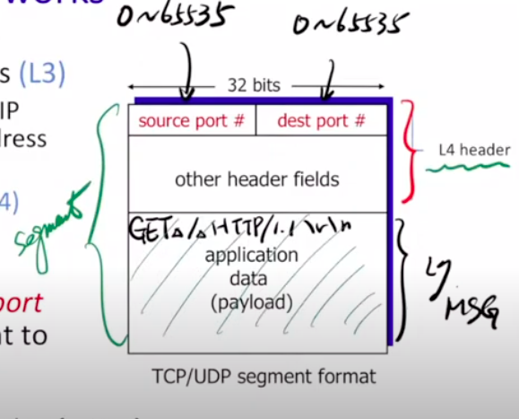

**Connectionless Demultiplexing(UDP 的情況)**
> 1. 當建立一個socket的時候，一定要指定一個port number(自己的)
> 2. 建立datagram的時候，要有目標的ip address和port
> 3. 確認segement的destination port number
> 4. 只要有同一個dest port和dest ip,就會給同一個socket吃到

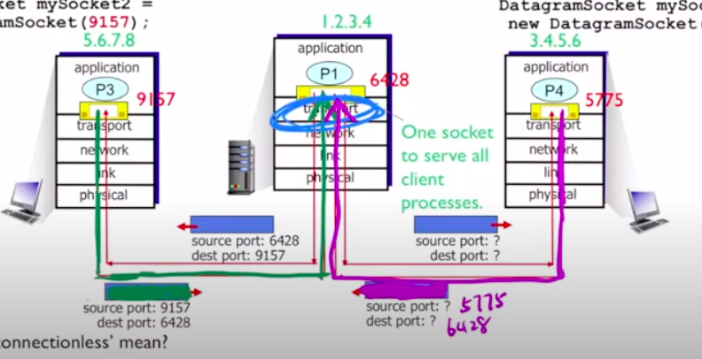

**Connection-oriented demultiplexing(TCP 的情況)**
> sourceID,sourcePort,destIP,destPort 一個不一樣就會有新的socket

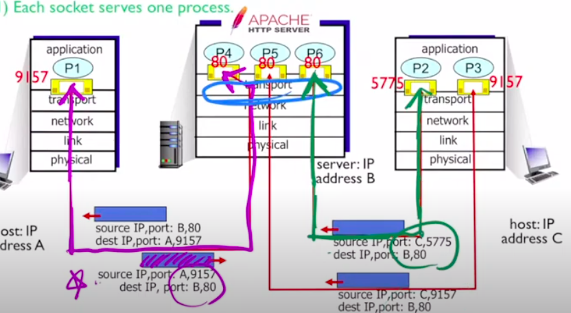

然而以前這樣開很多Socket會耗很多資源，新的方法是用thread

## 3.3 Connectionless Transport: UDP
基本上很簡單，因為只要管理自己的東西就好

**UDP的特點**
1. OS不需要先建立連結，省一個RTT
2. 不用維持statue
3. header size小

**UDP Segment Structure**
就header，header裡面有這些

1. source port number
2. dest port number
3. length：整個segment的長度(包含header(至少8))
4. checksum

**UDP Checksum**

知道整個封包有沒有錯的機制（注意：沒有要復原的意思，就知道錯而已）：把整個segement以16bit為單位切成一格，把大家都加起來變成一個sum(一個二進位的值)checksum的算法就是把sum的01翻過來，如果reciver發現有錯，那就會把封包丟掉，沒有錯就會接收。

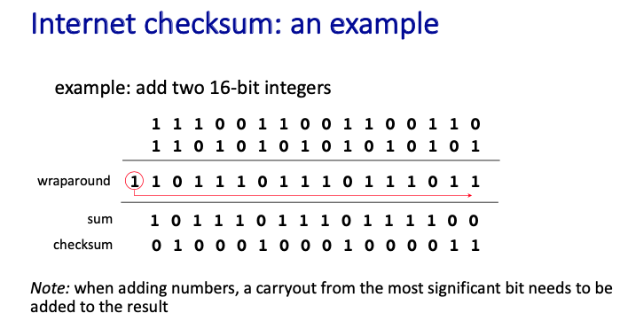

## 3.4 Principles of Reliable Data Transfer
因為網路是個不穩定的環境，所以要盡量控制那個錯誤，那就是reliable data transfer protocol

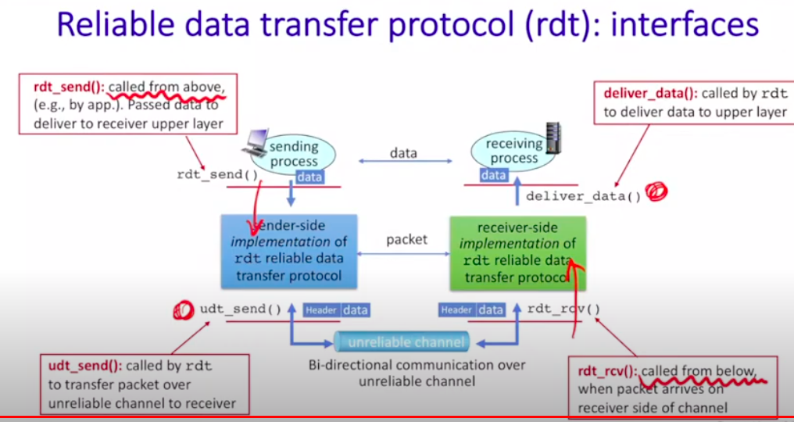

要注意圖片裡面的called from above和called from below

### Finite state machine(FSM)

假如一個系統很龐大，你不能直接用直覺判斷每個程序執行到什麼階段，因此用狀態來判別整個系統執行到那裡

舉例：販賣機

> 在販賣機裡面，我們可以簡單劃分幾個階段
> 1. 接收硬幣
> 2. 把商品燈亮起來，等待使用者去按
> 假設我們想要把販賣機化成流程圖討論，那當你有許多的商品時，你就需要多畫一條非常類似的線去討論該執行哪些事情，並且討論突發狀況時會有些複雜，而使用Finite state machine，我們就可以單就現在機器等待的狀態去討論。

而每個狀態到每個狀態之間要分別標示event和action，而event是觸發action的條件（例如在販賣機裡面，假如硬幣端收到了「接收夠多的前」這個event，那就會執行把燈亮起來的東做，並且等待使用者去按）而在規劃FSM的時候，可以畫表格來確定系統裡面會有哪些event，再畫成上面圖片的樣子。

> 在畫表格的時候，假如看到state之間沒有event，還是可以思考一下系統會不會出現一些bug，可以多一點catch throw 的空間

### Building a Reliable Data Transfer Protocol

**RDT 1.0**

假設：no bit error,no loss of packets 
| sender的FSM | receiver的FSM |
|---|---|
||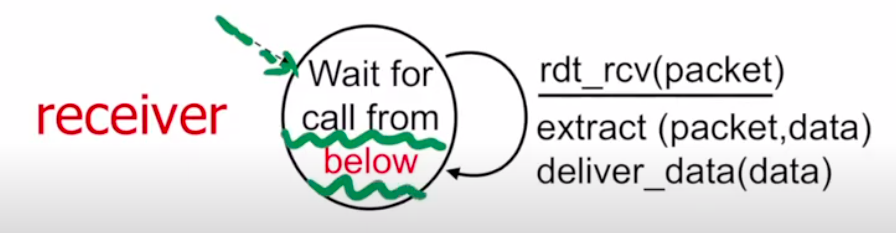|
|等call from above, 之後就把封包裝一裝，就丟出去，再等第二個封包|等 call from below, 接著拆封包|

**RDT 2.0**

假設：channel with bit errors 
特色：reciever 要通知sender說他送錯了，請再送一次
- acknowledgements(ACKs): reciver告訴sender傳好的
- negative acknowledgements(NAKs): receiver 告訴sender傳的有error

1. sender的FSM      Sender 一樣在call from above的狀態，收到訊息之後，要先算出checksum讓sender可以偵測error，接著把封包丟過去，接著進到wait for ack 的狀態，假如收到成功就結束了，等待下一個call from above. 假如失敗了，那就再送一次，然後再回到wait for ack.
2. receiver的FSM     receiver一直在wait for call from below，接到東西之後開始確定有沒有問題，假如沒問題就多送一個ack過去，失敗的話就回傳，回傳過後一樣回到wait for call from below

> 有互相等待的機制就叫 stop and wait

*萬無一失？*
假如送回去的ack或nak資料遺失怎麼辦（那個channel是不穩定地，會有bit error），上面沒有明確規範，所以需要RDT 2.1

**RDT 2.1**
為了避免sender因為判斷不出來ack nak在說什麼，因此幫封包來個編號，比免送過去重複的資料。

可以注意到在右上角的箭頭（wait for ack or nak 自己傳回去），它的條件多了一個corrupt(rcvpkt)，基本上ack壞掉一樣會再傳一次。

重點：所有的封包都帶有checksum還有packet number，假如ack機制壞掉，receiver可以跟sender提醒他剛剛的東西收過了或者是沒收到

**RDT 2.2**

特色：不使用NAK 
那要用什麼呢？ACK加上『下一個』想要收到的資料的編號。

**RDT 3.0**

問題：加上了loss 
現實情況：基本上只有sender知道有沒有到，因此請sender加上timer自行評估。

假設sender的timer已經到了，但其實ack有回來(duplicate ack)，但這樣D1還是會再送一次，因此ack的編號很重要，不然會搞錯。 

*Performance*

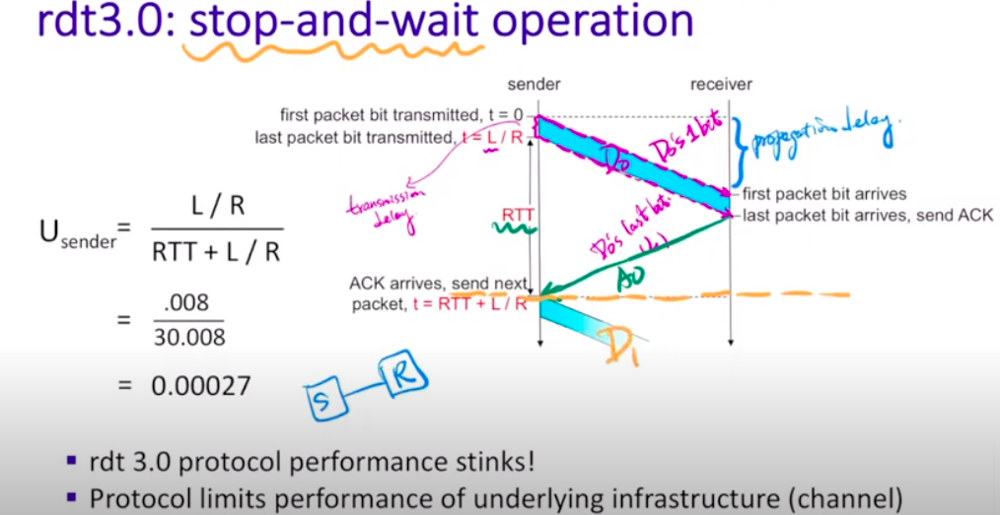
效率極差，因為是stop-and-wait，需要等到Receiver回傳的時候才會傳東西回來。

### Pipelined Reliable Data Transfer Protocols

簡單來說就是一次送一大堆過去，一次收到有多少封包出問題，接著再一次送過去。

### Go-Back-N (GBN)

要使用GBN這個演算法的原因是因為記憶體是有限的，因此不會一次把整個檔案傳過去，而是有個會移動的window。

**Sender**
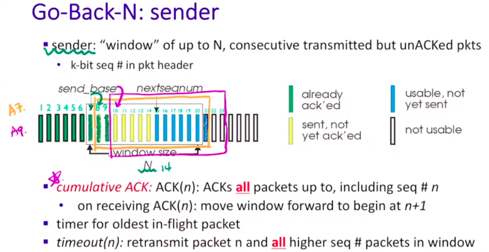

基本上就是依照記憶體的大小先給一個window，代表是隨時準備要傳出去了，那個windows裡面包含兩個部分，也就是sent but  not yet ack'ed (黃色)和usable but not yet sent（藍色），而 send_base 指向第一個黃色，nextseqnum指向第一個藍色，以下介紹兩個機制：

1. cumulative ACK：假設目前的send_base指向9，但是receiver回傳11的ack，那這個演算法會將9 10 11都當作already ack'ed，並且send_base會指向12
2. timeout：假設目前的send_base指向9，nextseqnum指向20，如果發生timeout，那9~19都會一起再傳過去（timeout是以send_base為基準）。

**Receiver**

1. ACK-only：一次收到很多**連續**的封包，可以回報最高的那個就好(expected sequence number前一個)
2. ACK number = expected sequence number：期待下一個來的封包序號
3. 注意，有可能封包來了，但是序號比你的expected number還要大(上圖紅色的地方)，那receiver該怎麼對這些數字比較大的封包呢？可以選擇丟掉或者留著都可以。

**GBN 的FSM**

當作補充，看看就好

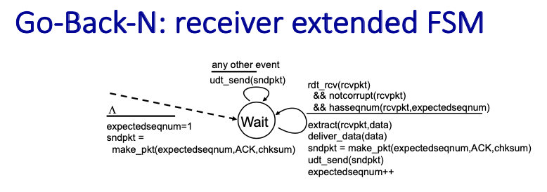

### Selective Repeat (SR)
sender直接回報給receiver每個封包的狀況，沒有使用cumulated的機制，因此每個封包的timer都是各自獨立的

總整理

**A Dilemma**

假如編號編得不好，那可能會把錯誤的封包接在一起：例如總共有7個封包，分別編號1,2,3,4,1,2,3，假如receiver收到第二個封包後，收到了第七個封包，序號上來看是123沒問題，但實際上他跳過了很多封包

> 這個錯誤是理論上的，因為現實情況數字非常的大，所以不太會有超級跳號的情況發生

**小小比較**

> 在網路環境比較好的情況下，GBN比較好

## 3.5 Connection-Oriented Transport: TCP
Overview

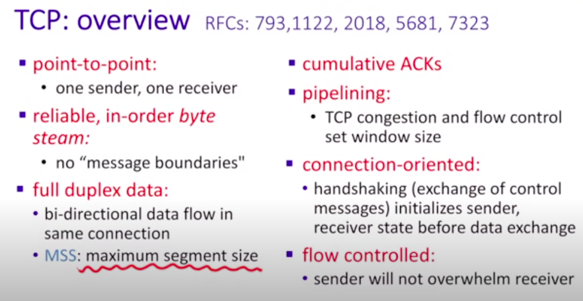

MSS: maximum segment size, 不同作業系統大小設定不一樣（單位是byte）

### TCP Segment Structure

**Head** 
word = 32 bits 
C,E:網路不好用 
U:urgent 
A:ACK 
P:Push 
R:Reset 
S:Syn 
F:Fin 

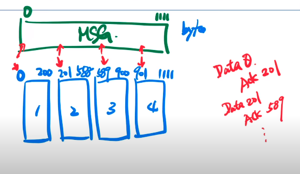

**TCP ACK**

1. 編號：對 segment 編號的方法其實是用 bit 的順序來編號，而 ack 的編號是下一個想要收到的 segment，當然，他是 cumulated 的。

2. tcp head裡面的東西改為A

3. TCP是雙方的，而兩邊各自的ack編號不一樣（因為兩個人傳的東西不一樣）

**Timer**

而timer要怎麼設定呢？以RTT(round trip time)當作基準去訂定timeout時間

注意：不能直接訂平均，因為會把一半都當作timeout，因此平均要加上一個差值（參考下圖）

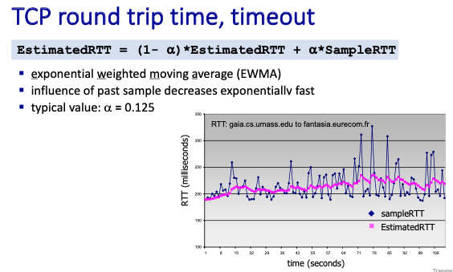

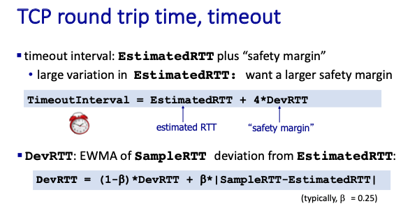

**TCP Sender(simplified)**

基本上跟GBN長得差不多

RTT一開始會由作業系統來決定，網路事件多一點之後就會動態決定那個 timeout 時間了

假如遇到duplicate的東西，那就不要理它

**TCP fast retransmit**

假如sender收到了連續的三個ACKs，那sender在收到timeout之前，我們就會把東西重送過去了（因為代表網路不好）

### Flow Control
因為只有receiver知道目前的網路環境、等等的，因此要把這個機制建立在receiver身上。

RcvBuffer: 他的大小一開始就被決定(4096 bite)。

主要要關注的事下方的free buffer space(只有receiver才知道)，在ACK中的某個小地方有個區域會告訴你free buffer space，叫sender節制一點（假如不節制，那傳過去的封包receiver負擔不了，只能丟掉）

**Connection Setup**

在真的要送東西之前，要先握手才會開始這段旅程

如果只有兩次握手呢？會有一大堆讓別人誤會的問題。

half open：右邊的 receiver 以為要建立，所以開了一個通道，但sender的東西太慢送來了，導致receiver會以為要再丟一次

TCP 3-way handshake
1. SYNbit = 1, seq = z
2. SYNbitt = 1, Seq = y, ACKbit = 1, ACKnum = x + 1
3. ACKbit = 1, ACKnum = y+1.

TCP: closing a connection
1. 準備關東西
2. 要來弄FIN的東西
3. 兩邊都沒東西要傳送了

假設最後一個掉了怎麼辦？（因為是最後一個，得不到暗示），sender必須要等兩倍的segment lifte time，避免他不是真的最後一個。

## 3.6 Principles of Congestion Control Control

sender 假如要自律發現網路不好，不要送太多，因為每個router都有自己的空間，假如空間不夠就會直接Loss掉，但router太忙了，他不會有空通知sender。

有四個速度，理論上會不一樣

TCP可以均分Router裡面的東西

- Scenario 1  router裡面的容量無限

- Scenario 2  
Sender知道Router會不會滿出來（讓它不會有Loss）

- Scenario 2.5  
sender知道剛剛送的哪一個封包掉了（Router會滿出來）
重送有兩個狀況
  1. Timeout
  2. Data 掉包
但目前只會出現第二種，因此那個速度只會差一點點

- Scenario 2.7  
會有timeout的情況發生，而且會有兩種情況
1. 真的掉了
2. 沒掉，只是塞車

從以上的情境我們可以知道，sender application傳送速率一定比 receiver application 的速率快。

## 3.7 TCP Congestion Control

那具體來說sender到底該怎麼控制自己呢？主要是用收到的ack來猜測sender可不可以繼續增加，這種方式稱為AIMD( Additive Increase Multiplicative) 

**術語分享**

- congestion window : TCP send 的中間的東西 (看起來跟GBN的window差不多）

- cwnd：是congestion window 的大小

- TCP rate: $\approx \dfrac{cwnd}{RTT}$

- slow start:因為要確定receiver還有網路的狀況好不好，所以一開始會從1 MSS(maximum segment size)開始丟，接著丟的速度會指數成長。

- ssthresh：不能一直指數成長，當突破這個值的時候會改成線性成長

- congestion avoidance: 到達某個數字之後不用指數成長，用線性成長

- Multiplicative decrease: 假如出現 packet loss 的情況，那將會降低速度來改善
  1. 砍半速度(TCP Reno)，當 packet loss發生在triplicate duplicate的時候
  2. 降到 1 MSS (TCP Tahoe)，當packet loss 發生在timeout

**整個congestion的FSM**

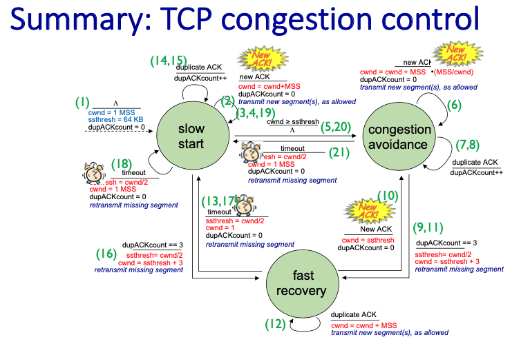

[補充]

TCP CUBIC：被砍半之後變成一個左上角$\dfrac{1}{4}$ 圓形

### TCP fairness

(待補)

## 3.8 Evolution of Transport-Layer Functionality
(老師沒講)

## 3.9 Summary
（老師沒講）
