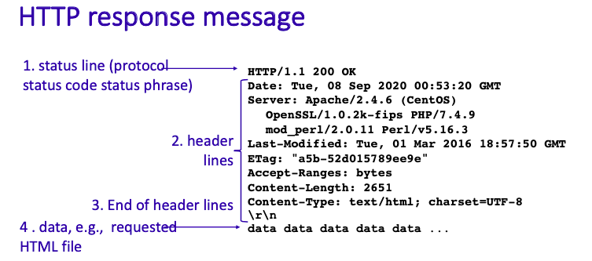
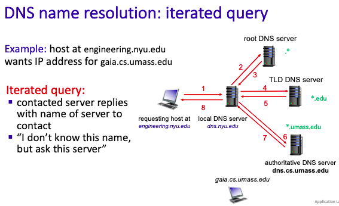
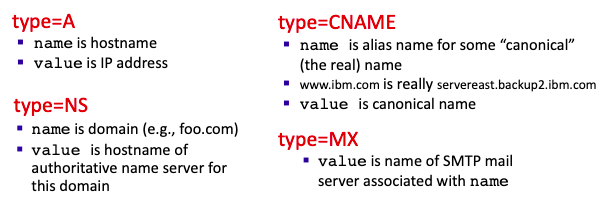

# Chapter 2. Application Layer

## 2.1 Priciples of Network Applications
注意，Network application 的內容基本上與network-core 無關，基本上就在意使用者就好

**Client-server**

多數的application都是以Client-server的架構進行，也就是溝通的兩端，一個是Client，一個是Server。

而server端通常是常駐開啟的，並且是被動接收資料，位於資料中心(data centers)，以及規模化

Client端是跟Server溝通的人，通常IP是浮動的。

**Peer-Peer**

與Client-server不同，沒有誰有特定的角色，互相幫助的感覺，本章後面會詳細提。

### Processes communicating

在一台機器裡面運作中的程式，我們叫它process，這章特別提到它是因為，Application Layer的作用就是協助兩支在不同電腦的程式，利用網路來互相溝通，以下是一些常見的名詞先介紹一下：

**Sockets**

每個程式都有自己的socket，它像是一個通道，資料會從通道被丟進程序裡，為了找到另一頭程式正確的socket，我們需要IP和Port，不然沒有辦法辨別你要丟給誰（因為一台機器裡面可能有多個程序）

### Application-layer protocol 規範了一些什麼？

1. message syntax: 資料溝通的格式
2. type of messages exchanged：也就是有幾種溝通的形式
3. message semantics:簡單來說很像在定義術語，例如寫一個大寫P在第三行會是什麼意思
4. rules:該在什麼時候丟訊息、回傳訊息等等的規則
 
### Application and Transport Layer

在設計一個Application Layer 的時候，因為不同的Application有不同用途，有一些不同的地方需要取捨，因此要搭配不同的Transport Layer來達到客制化，以下是一些需要注意的點：

1. data integrity:資料有沒有遺失？例如傳送檔案的application，應該要盡量避免檔案出現遺失，而音樂、影片可以在一定的tolerate下允許loss
2. timing: 它要不要求即時送到資料，還是可以慢慢來
3. throughput: 一次需要多少的資料傳輸量
4. security:希望資料不要被別人看到

下表是一些常見的application以及它的需求

應應以上的需求，我們的Trasport Layer有以下兩個分類

**TCP service**

- reliable transport
- flow control:sender不會傳讓receiver爆掉的資料量
- congestion control: sender不會在網路快爆調的時候傳資料
- connection-oriented: 需要兩方都準備好才會開始

而TCP沒辦法要求的是：1. 時間 2. mininum throughput 3. security

**UDP service**

基本上就只有傳送的功能，TCP有的它都沒有，但也因此會比較快一些（不用繁瑣的檢查）

下表是一些常見的Application和transport的配對

## 2.2 The Web and HTTP

Web簡單的感覺是：你用瀏覽器操做的application能做到的

而支持這些web application 的Protocol是HTTP(Hypertext transfer protocol)

以下一些HTTP小科普：
1. HTTP uses TCP:當然，你不希望看到別人網站是亂碼
2. "Server" listens at port 80
3. HTTP is stateless:也就是這次斷線之後，基本上他不知道你是誰（下面的章節會補充怎麼彌補）

而HTTP有兩種不同的connect 模式第一種**Non-persistent HTTP/1.0**，它每一次傳送一個檔案，就要「建立」一次連結，而模式第二種**Persistent HTTP**比較聰明，吃到request的時候會把TCP通道開著，假如要傳多個檔案就會一次傳過去。

### Request message
是Web的Client端跟Server溝通的訊息，廢話不多說，上圖

而request最需要注意的事request method，會因應跟web server有不同的互動方式有不同的方法，常見有以下幾種：

1. GET 就取得，通常要加東西就在後面加上?
2. POST 在request message 的後方還會有entity body去裝額外的資訊送給server
3. HEAD 不常用
4. PUT 不常用
5. DELETE 不常用，但應該很好理解

### Response message

而Response message是Server依照Client的請求還有程式執行的狀況，回應給client的內容，以下是結構：

而其中response有status codes,如其名，就是讓Client知道Server的狀態

- 200 OK 
  request成功，server會把client要的object或者想執行的指令給它
- 301 Moved Permanently 
  requested object被移走了，server會把object新的位子附在Client裡面
- 400 Bad Request 
  request message not understood by server
- 404 Not Found 
  requested document not found on this server,以及伺服器會給你他們家的404畫面
- 505 HTTP Version Not Supported

### Cookies

Cookies主要是用來記錄使用者資訊的工具，為什麼需要Cookie?因為HTTP是stateless的，一斷線就記不起來你的資訊。

cookies的原理：伺服器會對Client設定獨一無二的cookie給其中一位client，並且在自己的database裡面建立一個位子放那位使用者的資訊，當server收到了一個新的request，並且發現裡面有出現過的cookie，那server就可以去資料庫找資訊，並且知道這位client是誰

### Web caches(aka proxy servers)

**Web caches是什麼？**

他是一個位於client和server中間的角色，當client有request的時候，web caches會先檢查自己的內容有沒有過期，假如有，那caches會去跟server要新的資訊，要到之後respond給client，假如沒過期就直接傳給client。

**為什麼需要它？**

對client的好處：假如一間公司十個人需要一個網站的網頁，十個人都透過公司網路連到外部，並且跟server提取，那大家會把網路占滿，假如公司內部有caches，那公司網路只會由caches 發送一次request取得網頁資料，其餘公司內部只要利用內部網路跟caches來溝通就好。

對server的好處：減輕負擔好欸。

**Conditional GET**

至於Web caches要怎麼知道他的東西過期了沒有，那就要用到Conditional GET

Client發送的GET包含時間(If-modified-since:<date>)的話，會先發給caches，再發給server，假如檔案沒有變動，server會回給catch**304 Not Modified**，而caches會把client想要的object給它，假如伺服器發現檔案有變動，那伺服器就會把先的object給caches。

## 2.3 Electronic Mail in the Internet

大家常用的Email包含三個部分：
1. user agents: 使用者讀信、送信的地方
2. mail servers
3. simple mail transfer protocol: SMTP

為什麼需要多一個mail servers?不能直接user agents 互傳？

因為user agents不一定會整天開著，所以要有一個隨時可以收信的機器開著。

簡單講解整個Email送信的過程(以A送信給B當作範例)：
1. A使用他的user agents 發信給A自己的Mail server
2. A 的mail server發信給B的mail server
3. B 從他的mail server讀信（注意，這個動作不是SMTP）

名詞介紹
- Mailbox: 在mailserver裡面，主要存user收到的郵件
- message queue: 準備送出去的message

**SMTP規範了什麼？**

- 首先，他是一個以push為主的protocal，例如剛剛例子的A 從user agent push 到他的mail server，以及A server push 郵件內容到 B server。
- 他是以25作為port
- 連線的過程：交握、傳送資料、關閉
- 內容以ASCII 為主

**Mail formate**

## 2.4 DNS-The Internet's Directory Service

在前面的內容有提到，在網路世界中，資料的目的地有ip還有port，但對於普通人來說，忽然背一串數字做為地址非常的不直覺，因此至做的Domain Name 輔助大家閱讀地址，也因為這個服務，因此需要Domain Name Server 還有它的Protocal。

**DNS主要有什麼**
1. 分散式的資料庫：讓使用者可以查詢手上的Domain Name是對應哪個IP，之所以不採取中央式的是因為害怕那台中央的掛掉，大家都不用查了，因此要分工減少負擔（下面會細談）
2. application-layer protocol：要讓DNS知道你傳的這則資訊裡面，哪個部分是你想要找的ip，哪個部分是代表其他意思，因此要有protocol的規範。

**DNS的分工**

DNS有分為三個不同的角色
1. Root：專門接收所有的Domain Name，並且依照最後面的詞（.com,.org,.edu,...）發包給不同的Top Level Domain
2. Top Level Domain：專門接收屬於自己後面的詞的Domain Name，並且再看他的第二後面的詞是什麼，發包給Authoritative server
3. Authoritative：發真正的IP給你
4. local DNS server：你家附近的DNS（或者你自己建立的)，可以記錄你常用的DNS，以及幫你問root server，並且等待他們的回覆。跟HTTP的Proxy很像。

iterated query

recursive query

**DNS 結構**

DNS主要是查詢網址，但為了對應不同的情況，因此會有一些小工具釐清狀況
- TTL：主要記錄DNS裡面的IP有效時間，避免你查詢的目標換IP之類的
- DNS用UDP來查詢

*RR(resource records)*

可以發現剛剛的iterated query中，雖然都是發DNS，但是接受到DNS之後，所做的後續行動有所不同（例如local DNS收到root之後是繼續問下去，而接收到Authoritative DNS後就要回傳給user，因此要有格式來判斷一下有什麼差別

格式：(name, value, type, ttl)

備註：
- type=A：最普通那種
- type=NS：告訴你想查詢的Domain Dame 的 Authoritative DNS是誰，通常在這之後會附上一個Type=A的訊息，告訴你Authoritative DNS在哪
- type=CNAME：告訴你公司內部其實有酷酷的名字，跟公開那個不一樣。（可能為了利於管理，以及分攤伺服器工作量）
- type=MX：假如你要查詢email再找它

備註：前面的欄位主要是告訴你後面佔了多少空間，例如#questions裡面寫3，那代表下面的questions裡面有三個問題。

### 其他補充

**如何註冊DNS**
> 跟域名管理公司買 e.g. Go Daddy
> 並且要有一個固定IP 或者 有其他服務可以一直更新

## 2.5 Peer-to-Peer File Distrubution
Note: 以上其他的東西都是Server-Client 的設計

**特色**
- 每多一個Peer，整個網路就更強大
- 兩千年的時候比較火紅
- 假如打電話要通過很遠，會用P2P連線（但用P2P其他人就沒辦法監控打多久之類的）

### 傳輸效率

**Client-Server**
情境：將伺服器上傳一個檔案的資料量寫作$F$,上傳速率寫作$u_S$，總共有$n$位使用者，其下載速度為$d$,最慢的那位寫做$d_{min}$

- 理論速度$D_{C-S} \geq \max\{NF/u_S,F/d_{min}\}$ 

**P2P**

$D_{P2P} \geq \max\{F/u_S,F/d_{min},NF/(u_S + \sum u_j)\}$

這邊要注意的是最慢那位$F/d_{min}$之中的$F$是很多份小chunks，並且每個小chunks都來自於不同人

而$NF/(u_S + \sum u_j)$的部分是因為整個系統的人都可以做上傳這件事情。

### Others

BitTorrent, 一個檔案P2P服務提供者，他有一個tracker(server)去知道大家的資訊，讓你知道可以跟誰$P2P$

## 2.6* Video Streaming and Content Distribution Networks
（老師沒講）

## 2.7* Socket Programming: Creating Network Applications
（老師沒講）
