# Chapter 4 The Network Layer: Data Plane

在這一章，我們主要了解到在Router中，資料是如何被轉發的，其中就涉及到整個Layer 3的運作、Router的結構等等的內容。

## 4.1 Overview of Network

對於Layer 4 (Transport Layer), 他所服務的對象就是Application, 所以是process到process，而對於這章所要教的Layer 3 (Network Layer)，他所服務的是host到host，想辦法從來源host丟到目標host。

**network-layer functions:**
1. forwarding：在一個Router上，從第幾個port轉到第幾個port出去（感覺像一個圓環），難在速度要很快

2. routing：在Router海中找出一條路徑，可以走到目的地（就是個交通路網，包含很多圓環），難在要瞬間決定好路徑

> datagrams:常常說的『封包』，就是指Layer 3的

> Layer 3 的運作（IP）是綁在網卡身上，不是在host身上，雖然口語上都是說host to host

**Data plane, Control plane**

上面我們有提到forwarding 和 routing，而這兩件事情分別對應data plane和control plane。

1. [網管人參考](https://www.netadmin.com.tw/netadmin/zh-tw/technology/8BFD6B13235240FCA365BC54C967294B)
2. [電腦科技電子報](https://www.syscom.com.tw/ePaper_New_Content.aspx?id=473&EPID=212&TableName=sgEPArticle)

在網路中要怎麼決定forwarding 和 routing?我們有兩種方式：

- Traditional routing algorithm:
  - 每個router在正式傳送資料之前，會先確定自己的拓普（鄰居有誰，接著產生自己的forwarding table，整個網路依照Router的指示一直走。
- SDN(Softwar-Defined Networking)
  - 在SDN裡面，我們會把分成兩種plane:
    - Data plane: local, per-router function, 讓硬體去專心處理怎麼讓forwarding 變快
    - Control plane: 決定整個資料route的路徑，在SDN裡面才能夠實現的架構，因為有一個中央電腦，知道所有路由器的拓普，因此可以交給軟體去做計算
  - 

優缺點：
1. SDN直接有個中心，直接把大家的table 算好，之後再把table分別傳送給大家，理論上不可行，但假如有個機構管理了一大堆的路由器，那就可以用SND，缺點是有限制，優點是算的capacity比較小，也比較快可以一起算好。

> host身上也有forwarding table，不過通常目標就ADSL，很單純

「注意」

1. 基本上封包掉了就掉了，Layer 3 不會重傳一次，重傳是由Layer 4去處理（或不傳）。
2. datagrame 不一定會依照順序抵達，有可能是234先到，1才抵達。
3. 沒有minimum 的 branch
4. 基本上現在Layer 3 就剩IP，以前可能有其他的Layer 3 Protocal有提供順序、調封包的一些服務，但被淘汰了。

## 4.2 What's Inside a Router?（跟資管沒關係，當作科普）

1片的大小叫做1U，大一點的機器一台可能佔用2U,3U的空間

實際上某個東西進來會從任意Port出去，課本為了簡化都從左到右

- routing processor(software)
  - operates in millisecond time frame
- forwarding data plane(hardware)
  - operates in nanosecond time frame，總之一定要比上面還快

**Input port function**

這個部分可以想像成：在進到圓環之前，要先通過一些步驟

1. 綠色(bit)       ：Layer 1
2. 藍色(frame)     ：Layer 2
3. 紅色(datagrame) ：Layer 3, lookup, forwarding

switch fabric: 指的是圓環本人，以下有一些途徑
- Switching via **memory**
  - 中間是用memory當作連接，利用bus來傳輸
  - 
- Switching via a **bus**
  - memory放在每一個port的最後，直接用bus傳到另一個人的memory
  - 這樣的結構會產生的問題是會有佔用的問題。
  - 
- Switching via **interconnection network**
  - 既然會佔用，那就多來幾個bus
  - 

**Queuing**
- Input port queuing
  - 如果switch fabric 太慢，那input就會塞車
  - HOL(Head-of-the-Line) blocking:兩個port都要傳到port 1, 但後面那個人可以去沒人要的port 2 
- Output port queuing
  - 
  - 有可能port的線路不夠快，所以output也會有個queuing
  - 我們在意那個output的buffer
  - 通常queueing delay and loss 是因為output port buffer overflow

> 注意：這邊的server只是表示他要服務第一個來排隊的人

### Packet Scheduling

RT，就是決定Packet該怎麼送出去，基本上排隊是用FIFO，特別的是可能會有兩個queue，但只有一個server

**Priority**

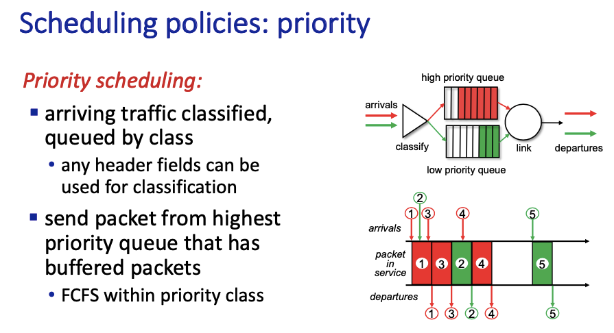

指的是分為兩種queue，一種是high priority queue，另一個是低的。

backlog, starving 指的是一直服務priority 高的，導致priority低的送不出去，但通常只會在家裡有這個機制，router海不做這件事情。

**Round Robin(RR)**

把queue分為多種，server輪流處理

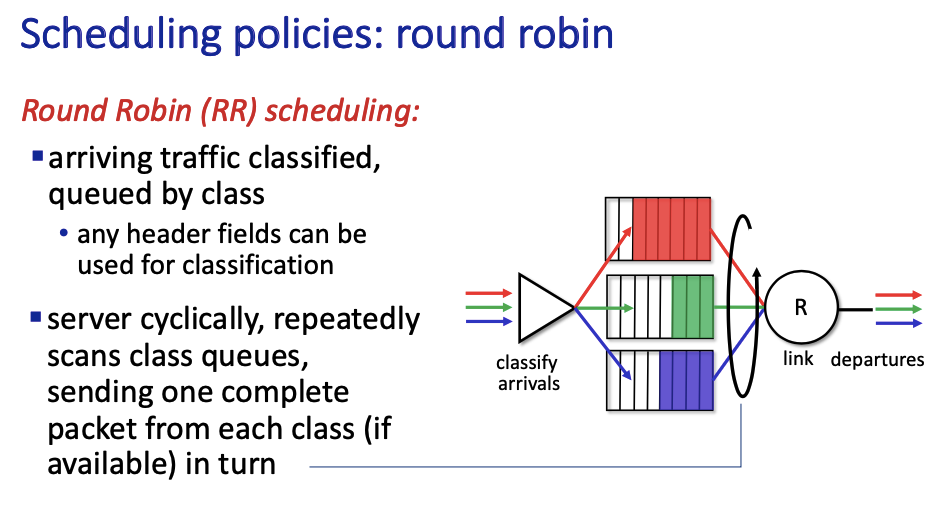

重點是Weighted Fair Queuing(WFQ)，在不同的queuuing有不同的weight，長時間來看就可以有一點點proiority。

## 4.3 The Internet Protocol (IP): IPv4, Addressing, IPv6, and More

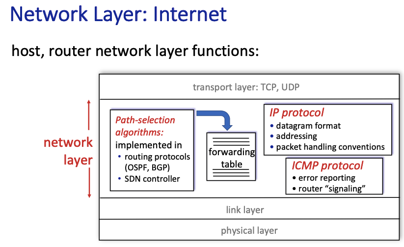

這個章節，我們將會看到Network Layer大致上會做些什麼，上圖就是一個感覺：）

Router真正開始運作之前會先跑 Path-selection algorithms，並且生出forwarding table 出來，也就是control plan 的事情，ICMP這個Protocal是防止router翻車用的

**Datagram format**

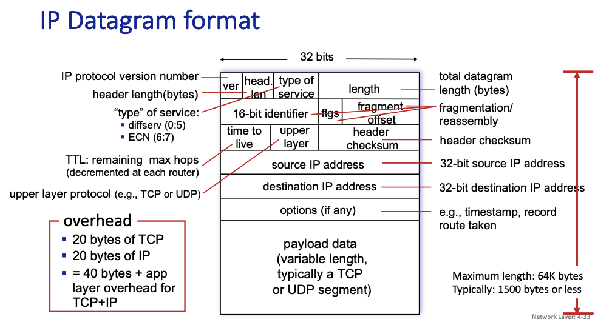

整張圖是一個完整的datagrame，下面的部分是segement，也就是上一個章節討論的Layer 4，上面的五行是固定的，下面有options但是通常用不到，以下是一些小部分的介紹：

1. type of servicie: 本來是設計來插隊了，

2. TTL:每經過一站就會減一，常常初始值是128 or 64，假如它被扣完了，router應該要直接丟掉（畢竟實際上最多也才十幾個站就該到了）

3. upper layer:用來表示放在segement是哪位，假如是TCP是6，UDP是17，1是ICMP(除錯用，是Layer 3但是放在segement那邊)

**fragmentation/reassembly**

在網路世界中，總有幾個比較弱的Router，會因為能處理的數據量太小，導致大封包過不去，但又沒有辦法叫Client從頭送一個小一點的封包過來（上一章有討論過），所以Router會自己判斷下一個Router的承載量怎麼樣，並且把它切一切。

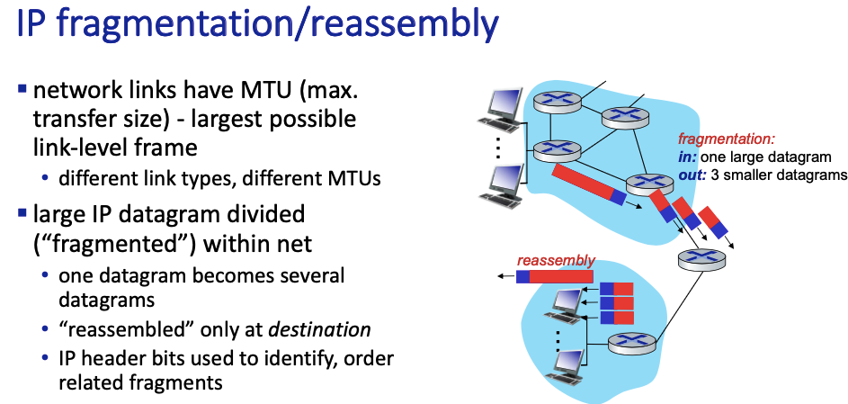

MTU指的是可以容納的封包的大小，今天我們有BCD，其中C的MTU最小

B知道C的狀況，所以B會把封包切一切，這個動作叫做(fragmentation)，而到了D，他會對這些封包作reassembly，把它們塞回去。

以下是個範例我們該怎麼切，其中每個人的header都要在，所以要特別注意，header佔20 byte。

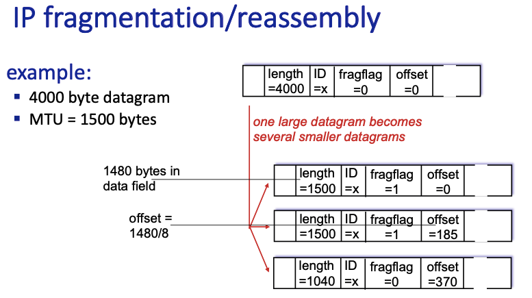

fraglag指的是後面還有沒有，假如是1代表它不是最後一個，假如是0代表它是最後一個，可以重組了。

offset:用來計算這個封包是從第幾個offset開始的，而一個offset有8bytes

### IP addressing

在網路世界裡面，IP就像是每台機器（網卡）的地址，這個小節就是要來介紹一些跟IP有關的一些機制

**Subnet**

投影片也沒定義很詳細，知道他是以Router為邊界就好，並且他們前面會有一段IP都是一樣的。

> 注意：switch 是 layer 2 的設備，不要弄錯

**CIDR(Classless InterDomain Routing)**

白癡作業考了一大堆，通常IP是長這個樣子：a.b.c.d/x，其中，那個x就代表了subnet在整串IP裡面佔了多少

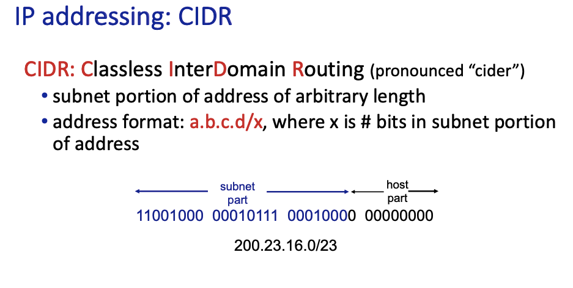

計算

假如題目給你一個IP還有一串mask，都寫出來然後取交集就對了，原理未知。

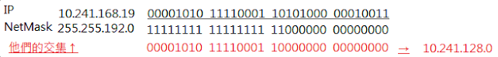

**DHCP(Dynamic Host Configuration Protocol)**

這個Protocal主要是讓DHCP Server可以分發IP給新來的朋友，另外，他好像是個Layer 7 的Protocal

但問題來了，你沒有IP的話，你要怎麼跟DHCP的Server溝通呢？他也是網路的一個人，因此你要想辦法在沒有IP的情況下跟它溝通，以下會介紹機制

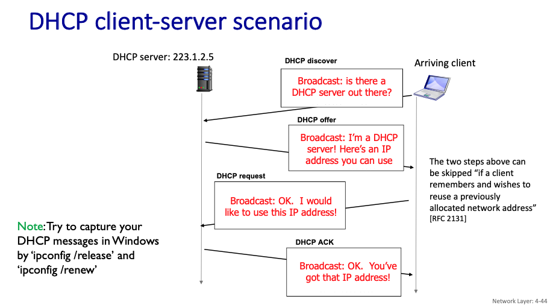

一開始，Client會把自己的IP設定為0.0.0.0(unknown)，並且用Broadcast的方式來找DHCP Server

找到之後，DHCP Server會把空的IP給Client，接著會再有兩段式的確認，以下是他們的wire shark

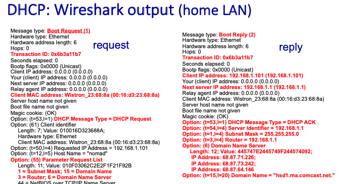

### NAT(Network address translation)

主要就是當初設計網路的時候設計了Private IP，但在這之中要怎麼跟其他有public IP 的host互相溝通，這就是NAT 要處理的事情，以下就是所有的過程

1. 有個有Private IP的人想要發送給某個外面的人，它先用Private IP 和正常的Port發送出去，並且被NAT看到
2. NAT先把這個Private IP記載NAT translation table裡面，並且給它一個port，並且把封包裡面的IP改成public IP(然後也記載在table裡面)，接著發送給server
3. server丟回來，NAT看一下表，有沒有符合的port，有的話就接收
4. 把response裡面的目標ip改成private ip

### IPv6

總之老師很簡單的講過去了，我們要來看一下當IPv6傳送的中間，遇到了IPv4的router該怎麼辦

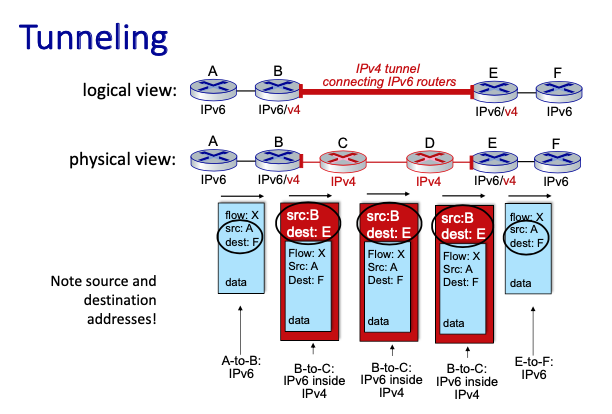

### 老師補充篇

主要參考[這篇](https://zh.wikipedia.org/zh-tw/%E5%88%86%E7%B1%BB%E7%BD%91%E7%BB%9C)維基百科

這是老師畫的圖

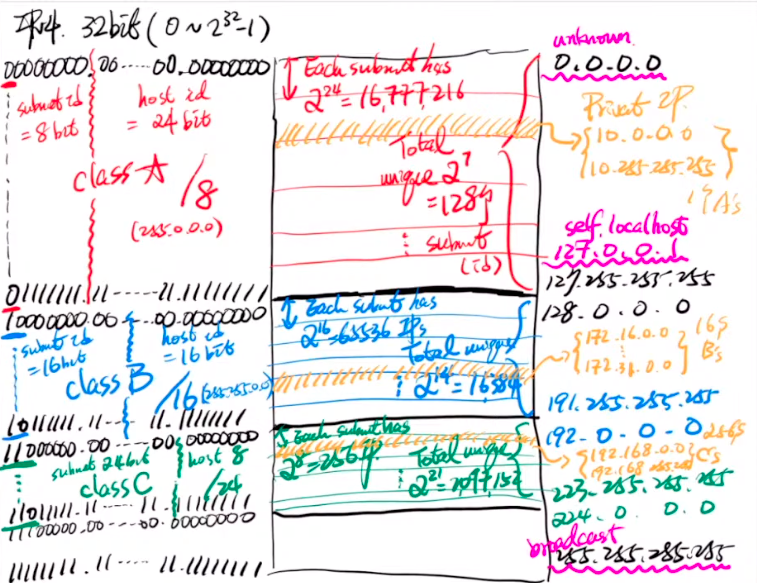

**分類**

這張圖可以看見，紅色的Class A佔了所有IP的一半，藍色的Class B佔了剩下來一半的一半，綠色的就是一半的一半的一半（Class C）

**各自的特色**

分完類之後，我們會想觀察

1. 他們是/幾（CIDR裡面的那個，子網路佔了多少部分）
2. 他們有幾個host
3. 一個subnet裡面有幾個host

這些東西都在這個表格裡面

**Private IP**
就是老師的圖片裡面，每個Class中都有被切一些黃色的部分，那些就是。

## 4.4 Generalized Forwarding and SDN

## 4.5 Middleboxes

## 4.6 Summary

