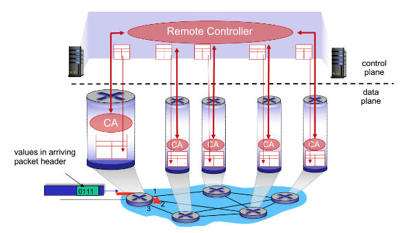
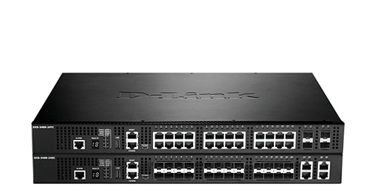
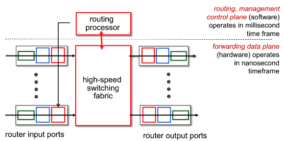
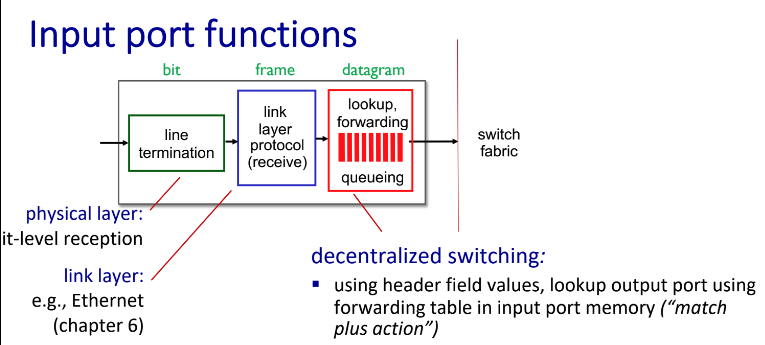
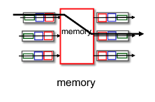
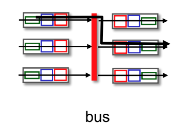
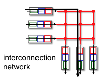
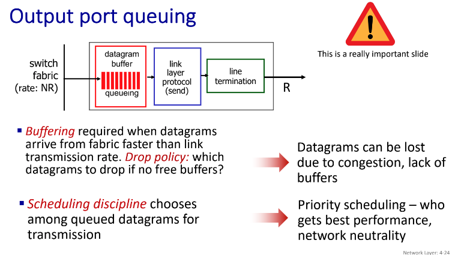

# Chapter 4 The Network Layer: Data Plane

## 4.1 Overview of Network

對於Layer 4, 他所服務的對象就是Application, 所以是process到process，而對於這章所要教的Layer 3，他所服務的是host到host，想辦法從來源host丟到目標host。

**network-layer functions:** 
1. forwarding:單機上，從第幾個port轉到第幾個port出去（感覺像一個圓環），難在速度要很快

2. routing:找出一條路徑，可以走到目的地（就是個交通路網，包含很多圓環），難在要瞬間決定好路徑 

> datagrams:常常說的『封包』，就是指Layer 3的

> Layer 3 的運作（IP）是綁在網卡身上，不是在host身上，雖然口語上都是說host to host

**Data plane, Control plane**

上面我們有提到forwarding 和 routing，而這兩件事情分別對應data plane和control plane。

1. [網管人參考](https://www.netadmin.com.tw/netadmin/zh-tw/technology/8BFD6B13235240FCA365BC54C967294B)
2. [電腦科技電子報](https://www.syscom.com.tw/ePaper_New_Content.aspx?id=473&EPID=212&TableName=sgEPArticle)

在網路中要怎麼決定forwarding 和 routing?我們有兩種方式：

- Traditional routing algorithm:
  - 每個router在正式傳送資料之前，會先確定自己的拓普（鄰居有誰，接著產生自己的forwarding table，整個網路依照Router的指示一直走。
- SDN(Softwar-Defined Networking)
  - 在SDN裡面，我們會把分成兩種plane:
    - Data plane: local, per-router function, 讓硬體去專心處理怎麼讓forwarding 變快
    - Control plane: 決定整個資料route的路徑，在SDN裡面才能夠實現的架構，因為有一個中央電腦，知道所有路由器的拓普，因此可以交給軟體去做計算
  -   

優缺點：
1. SDN直接有個中心，直接把大家的table 算好，之後再把table分別傳送給大家，理論上不可行，但假如有個機構管理了一大堆的路由器，那就可以用SND，缺點是有限制，優點是算的camacity比較小，也比較快可以一起算好。

> host身上也有forwarding table，不過通常目標就ADSL，很單純

「注意」

1. 基本上封包掉了就掉了，Layer 3 不會重傳一次，重傳是由Layer 4去處理（或不傳）。
2. datagrame 不一定會依照順序抵達，有可能是234先到，1才抵達。
3. 沒有minimum 的 branch
4. 基本上現在Layer 3 就剩IP，以前可能有其他的Layer 3 Protocal有提供順序、調封包的一些服務，但被淘汰了。

## 4.2 What's Inside a Router?（跟資管沒關係，當作科普）

1片的大小叫做1U，大一點的機器一台可能佔用2U,3U的空間

實際上某個東西進來會從任意Port出去，課本為了簡化都從左到右

- routing processor(software)
  - operates in millisecond time frame
- forwarding data plane(hardware)
  - operates in nanosecond time frame，總之一定要比上面還快

**Input port function**

這個部分可以想像成：在進到圓環之前，要先通過一些步驟

1. 綠色(bit)       ：Layer 1
2. 藍色(frame)     ：Layer 2
3. 紅色(datagrame) ：Layer 3, lookup, forwarding

switch fabric: 指的是圓環本人，以下有一些途徑
- Switching via memory
  - 中間是用memory當作連接，利用bus來傳輸
  - 
- Sitchin via a bus
  - memory放在每一個port的最後，直接用bus傳到另一個人的memory
  - 這樣的結構會產生的問題是會有佔用的問題。
  - 
- Switching via interconnection network
  - 既然會佔用，那就多來幾個bus
  - 

**Queuing**
- Input port queuing
  - 如果switch fabric 太慢，那input就會塞車
  - HOL(Head-of-the-Line) blocking:兩個port都要傳到port 1, 但後面那個人可以去沒人要的port 2 
- Output port queuing
  - 
  - 有可能port的線路不夠快，所以output也會有個queuing
  - 我們在意那個output的buffer
  - 通常queueing delay and loss 是因為out put port buffer overflow

> 注意：這邊的server只是表示他要服務第一個來排隊的人

基本上排隊是用FIFO，特別的事可能會有兩種queue，但只有一個server

backlog, starving 指的是一直服務priority 高的，導致priority低的送不出去，但通常只會在家裡有這個機制，router海不做這件事情。

**Round Robin(RR)**

輪流的意思，重點是Weighted Fair Queuing(WFQ)，在不同的queuuing有不同的weight，長時間來看就可以有一點點proiority。

## 4.3 The Internet Protocol (IP): IPv4, Addressing, IPv6, and More

Router真正開始運作之前會先跑 Path-selection algorithms，並且生出forwarding table 出來，control plan 的事情

ICMP：防止router翻車

整張圖是一個完整的datagrame，下面的部分是segement，也就是H4

上面的五行是固定的，下面有options但是通常用不到

type of servicie: 本來是設計來插隊了，

TTL:每經過一站就會減一，常常初始值是128 or 64，假如它被扣完了，router應該要直接丟掉（畢竟實際上最多也才十幾個站就該到了）

upper layer:用來表示放在segement是哪位，假如是TCP是6，UDP是17，1是ICMP(除錯用，是Layer 3但是放在segement那邊)

MTU指的是可以容納的封包的大小，今天我們有BCD，其中C的MTU最小

B知道C的狀況，所以B會把封包切一切，這個動作叫做(fragmentation)，而到了D，他會對這些封包作reassembly，把它們塞回去。

以下是個範例我們該怎麼切，其中每個人的header都要在，所以要特別注意，header佔20 byte。

fraglag指的是後面還有沒有，假如是1代表它不是最後一個，假如是0代表它是最後一個，可以重組了。

offset: 8 bytes

子網路的邊界是router

switch 是 layer 2 的設備

CIDR:Classless InterDomain Routing

DHCP: Dynamic Host Configuration Protocol

假如你還沒有ip但要跟subnet裡面的人溝通的時候該怎麼辦？

broadcast: 給所有機器知道資訊，通常不需要的會丟掉

## 4.4 Generalized Forwarding and SDN

## 4.5 Middleboxes

## 4.6 Summary

