# Chapter 5 The Network Layer: Control Plane

## 5.1 Introduction

上個章節有提到，Control Plane主要是在討論路由器到路由器之間路徑的移動。

## 5.2 Routing Algorithms
**routing protocols**
決定sender router到receiver router之間最好（快、省錢、少壅塞）的路徑

### routing algorithm 四大方向：

在Router海的世界裡，不一定每個Router都能有全部的觀點，並且Router之間的拓樸可能會在一段時間後有了變化，因此設計演算法時可以注意這四大方向：

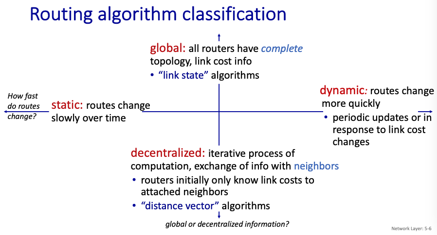

* global: ，每個router都有上帝視角可以看到全部routers路徑和link costs，*link state*便是注重這類型的演算法。
* decentralized: 每個router只能看到自己附近的routers路徑和link cost，*distance vector*注重此項目
* static： 指的是整個網路拓樸之間變動很頻繁
* dynamic：網路拓樸沒什麼在變

### link state（Dijkstra's algorithm

白話解釋：對於sender到receiver之間有眾多routers需設定一個最佳路徑時，每多考慮一個router便會多出一些路徑可使用，於是最短路徑會一直更新，直到把所有routers都考慮進去

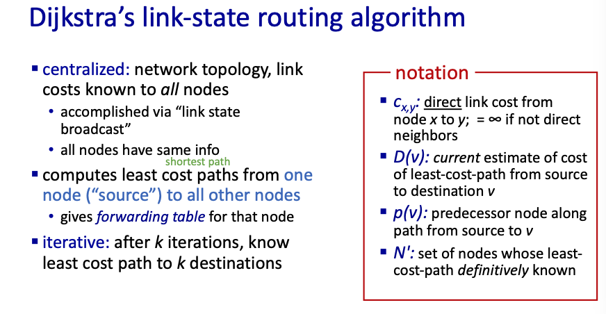

**Example**

例如下圖，先考慮u，接著觀察哪一個能抵達的router中，是距離u最快的，並且選出那個最快的，並且在下一輪同時考慮u和x

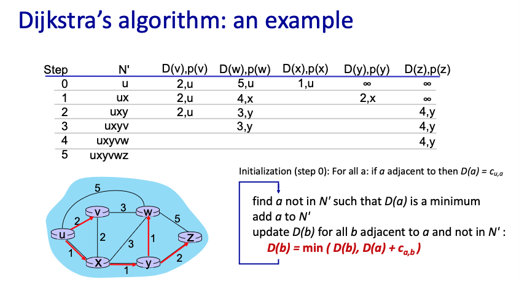

### distance vector
白話解釋：問x->y最短距離，x和y中間有v，則分別求x->v和v->y的最短距離相加。若v和y中間又有w，同理進行迭代

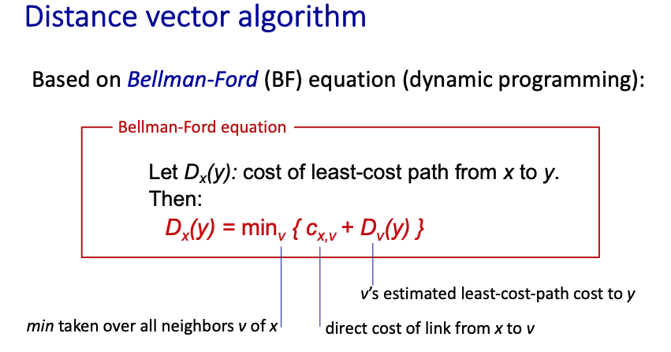

**Example**

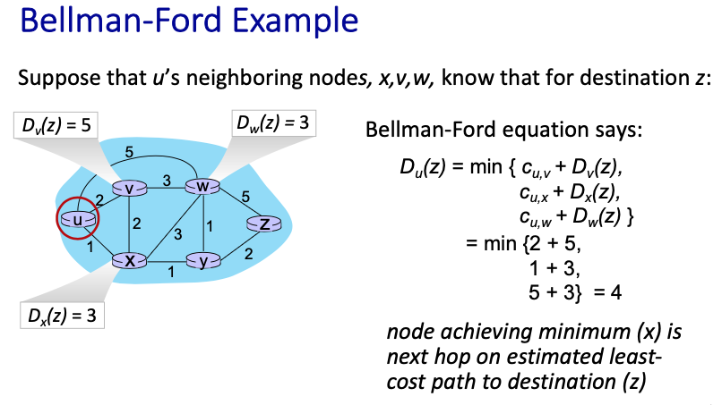

**link cost change 問題**
也就是當有一個路徑的cost變得超大的時候，迭代的次數會非常多才能更新完每個人的table
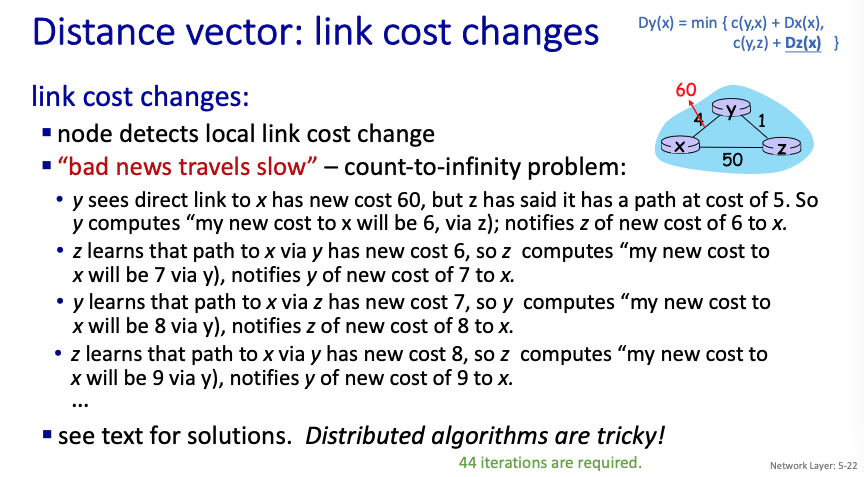

### LS和DV的比較

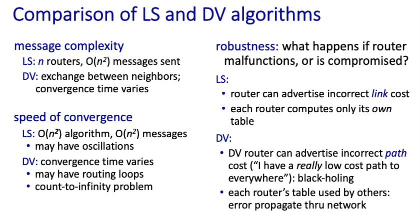

## 5.3 Intra-AS Routing in the Internet: OSPF

**什麼是 Intra-AS Routing**

在前一個章節我們已經知道，Link State演算法比較快，但是我們並不能在一個時間知道全球的網路拓樸，但我們能知道局部的，因此在我們能控制的局部，我們將它定義為Intra，在外部的傳輸我們定義為Inter

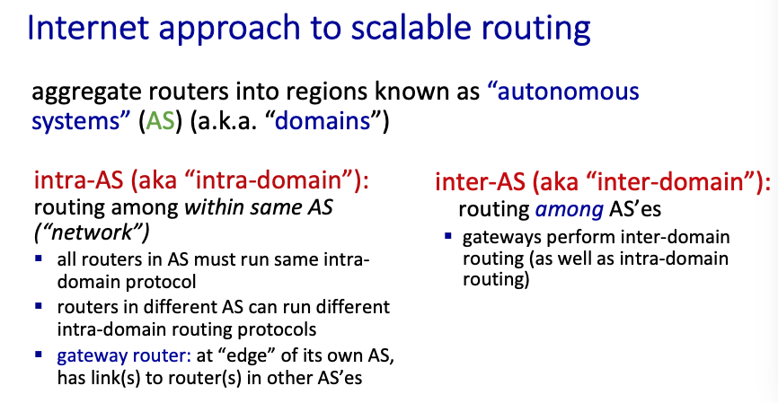

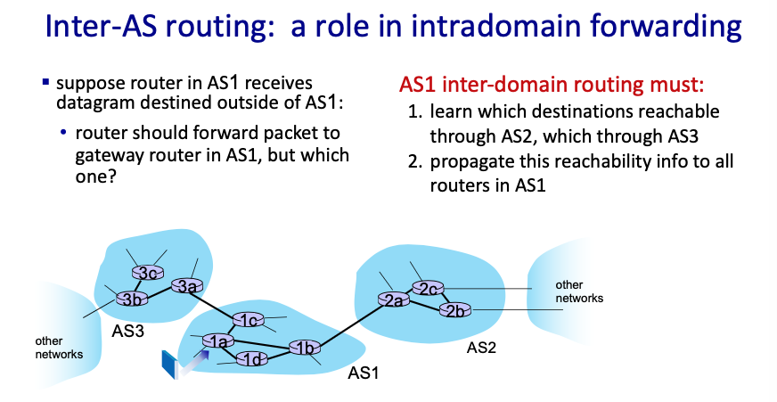

而在Intra之中，我們常用的Protocol有以下這些

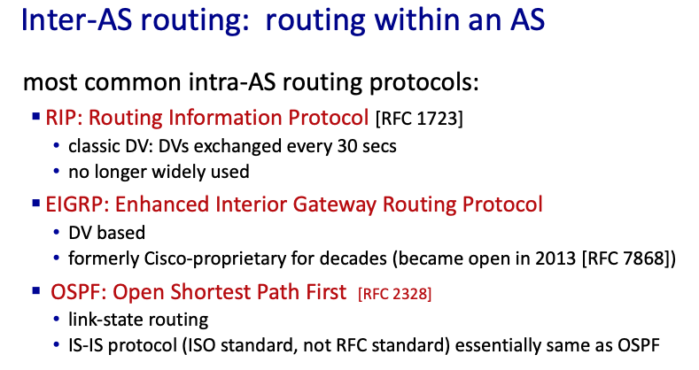

**OSPF簡介**
屬於*link state*（需要獲得整個AS內的global view)，會跟在OSPF link-state裡面的人最溝通（不只是自己附近的），並且基本上三十分鐘就會重新確認一下裡面人的table

**多階名詞介紹**

但在整個機構裡面的router都使用OSPF是不現實的（很慢），因此我們會畫一個多階的結構去管理整個組織的網路。

- boundary router: 跟其他外部的router做溝通的那個router
- backbone : 在OSPF裡面所有的Router
- local routers： 沒有在OSPF裏面的Router，但還是歸整個機構管
- area border routers： 主要連接backbone和local routers的那位

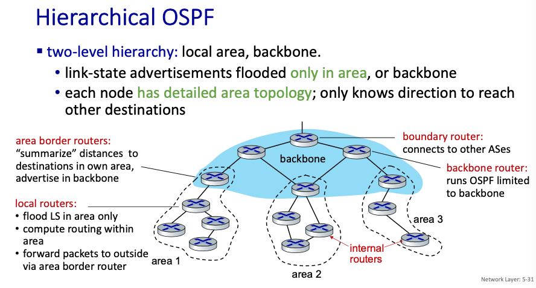

## 5.4 Routing Among the ISPs: BGP

這邊主要就是在談 inter之間資料的傳輸，這邊先介紹常用的Protocol BGP，全名Border Gateway Protocol

**BGP 簡介**

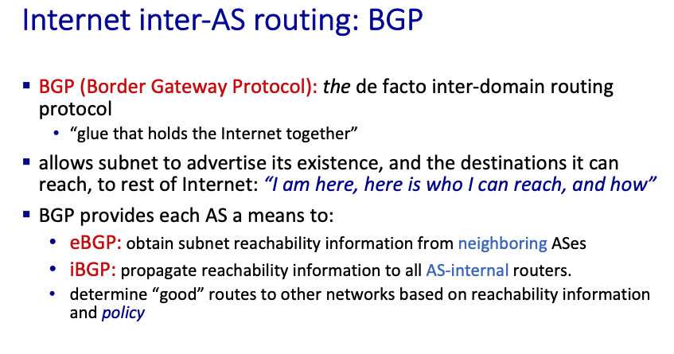

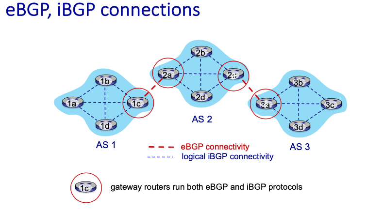

### BGP 機制介紹

沒人知道，對下面這張圖有個印象就好

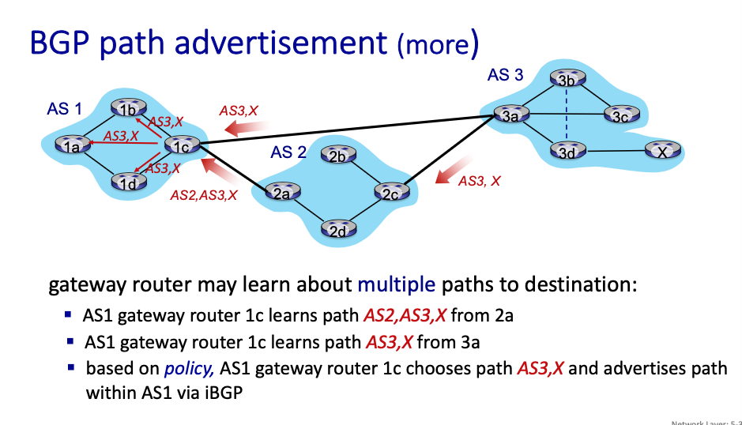

### Intra-, Inter-AS 為什麼要差異設計

在intra的世界裡，我們要注意的是效能，希望在自己的區域裡面資料越快被處理越好。

但在Inter的世界裡，policy優先，例如有可能AB兩國之間在打仗，那你的網路就不能經過他們。

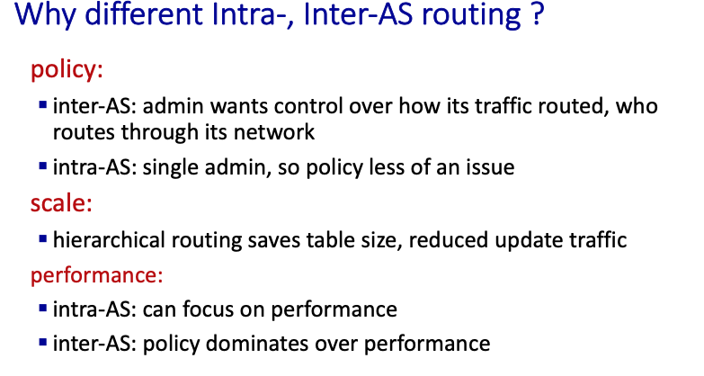

## 5.5 The SDN Control Plane

## 5.6 ICMP: The Internet Control Message Protocol

傳說中的ping