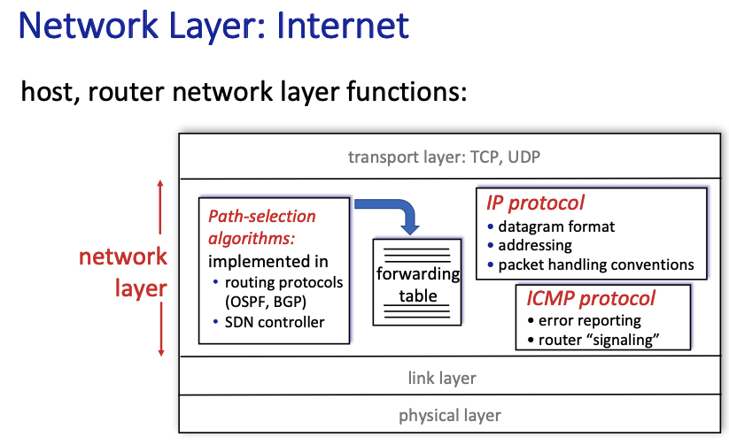

# 5.md

## 5.1 Introduction

# 大標題
## 中標題
### 小標題

**粗體**

*斜體*

****
----

[超連結](https://www.google.com)



表格測試

|火雞肉飯|魯肉飯|te|
|-|-|-|
|白色|棕色|test|

1. 數字表單
2. 數字表單2
3. 數字表單3

* 項目
* 項目
    * 項目2

> 引言，或者是注意

code block

```py
i = 20
print(i)
```

~~~java
System.out.print("Hello World")
~~~


## 5.2 Routing Algorithms
(威致12/14試打第五章)
global

## 5.3 Intra-AS Routing in the Internet: OSPF

## 5.4 Routing Among the ISPs: BGP

## 5.5 The SDN Control Plane

## 5.6 ICMP: The Internet Control Message Protocol