# Chapter 6 The Link Layer and LANs

## 6.1 Introduction to the Link Layer

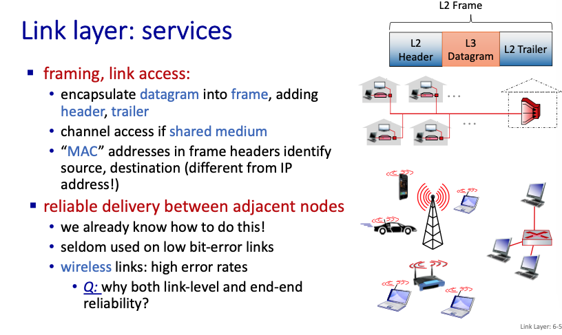

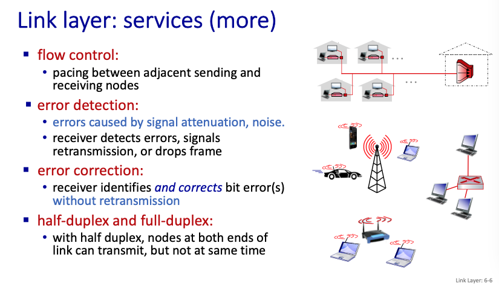

## 6.2 Error-Detection and Correction Techniques

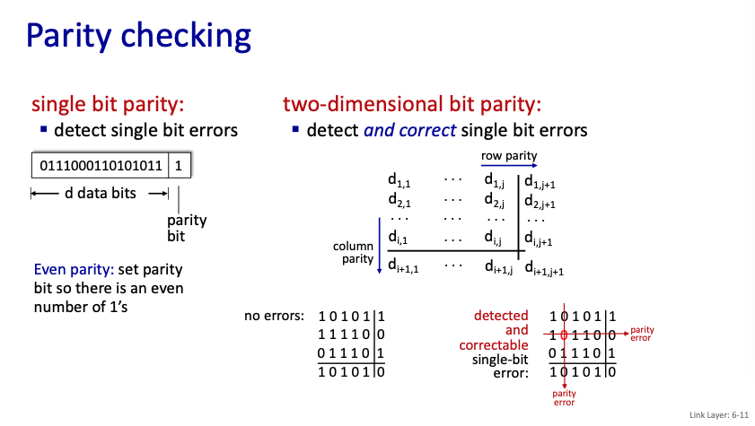

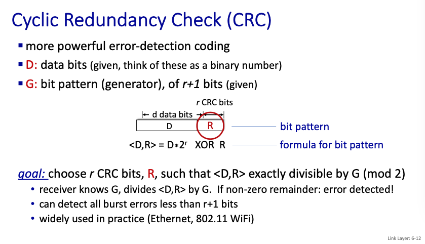

**Example**

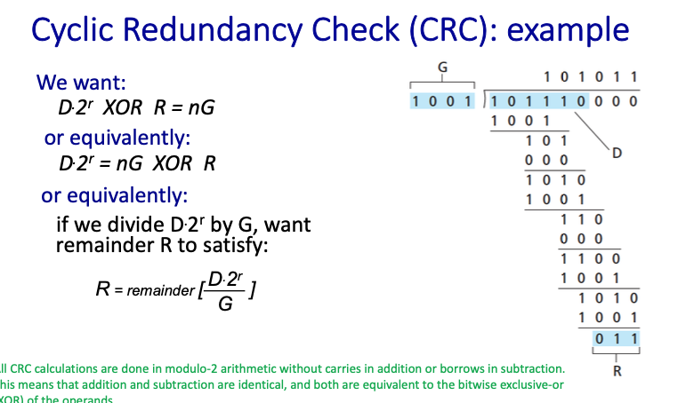

## 6.3 Multiple Access Links and Protocols

**簡介情境**

**不同的種類**

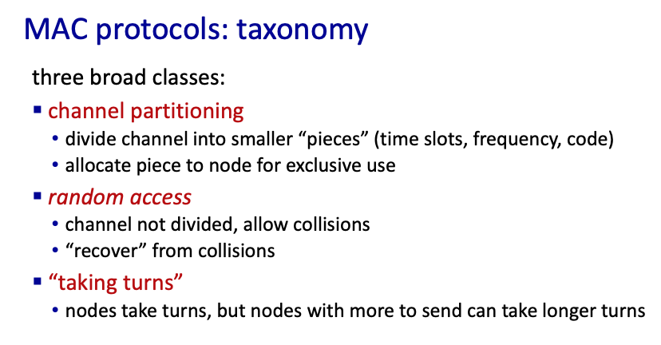

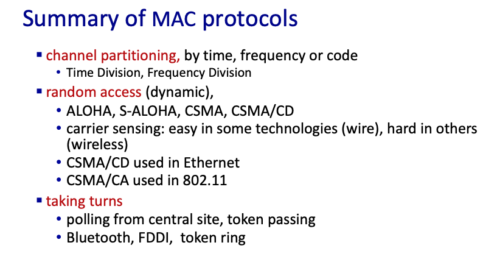
### Channel partition

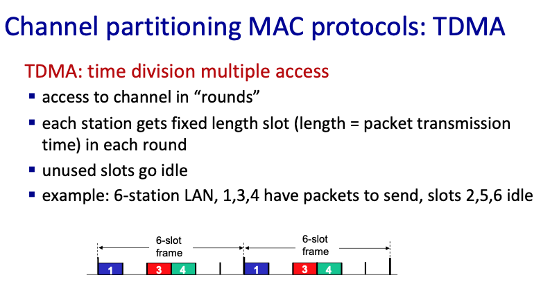

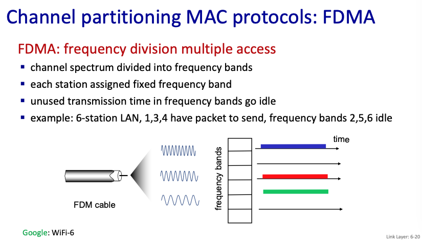

### Random access

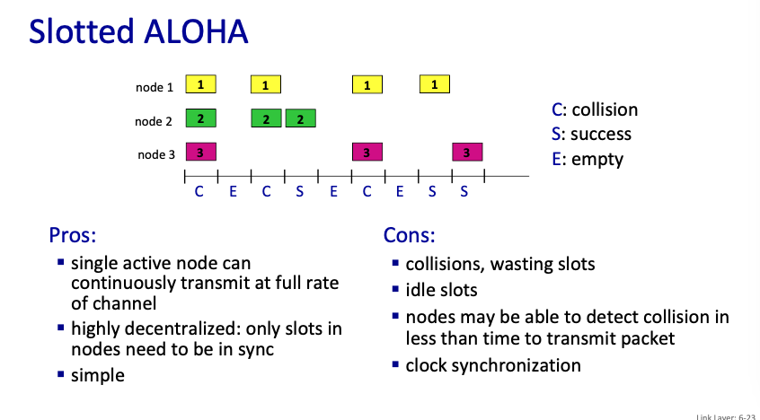

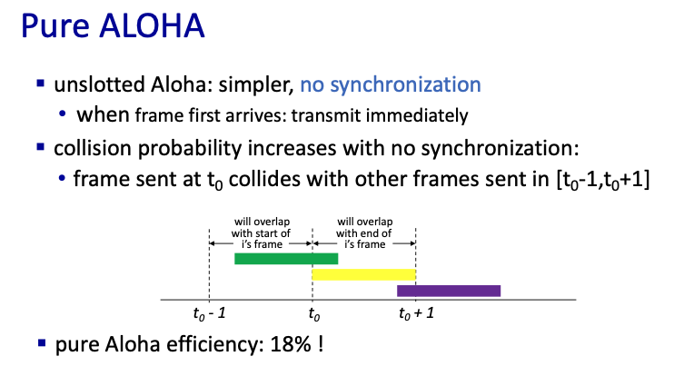

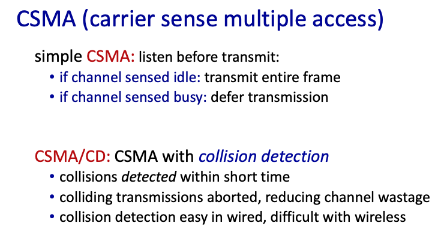

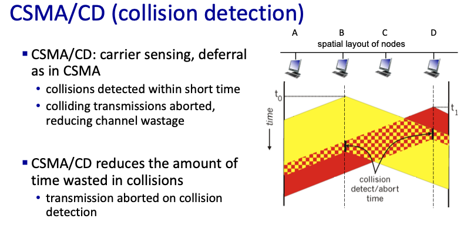

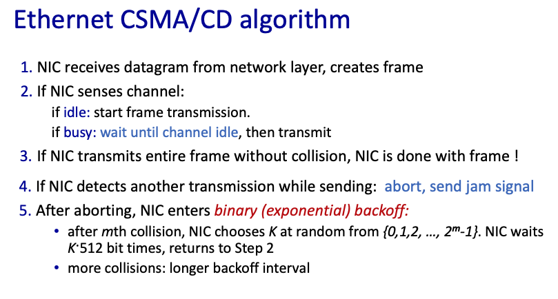

### taking turns

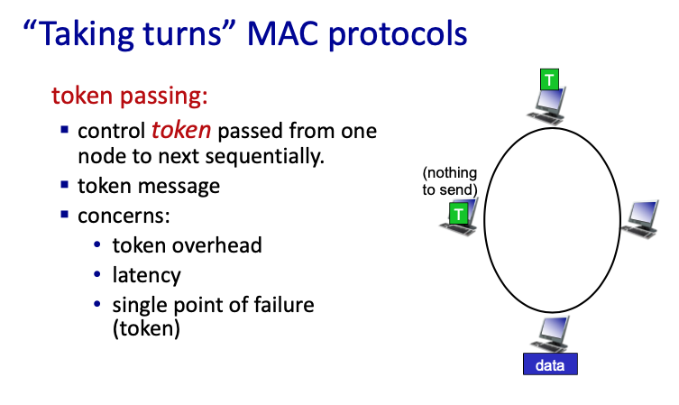

## 6.4 Switched Local Area Networks

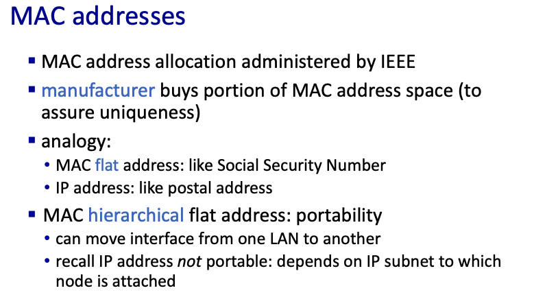

**ARP protocol in action**

(簡報 42 ~ 44)

**Routing to another subnet: addressing**

(簡報 45 ~ 50)

### Ethernet

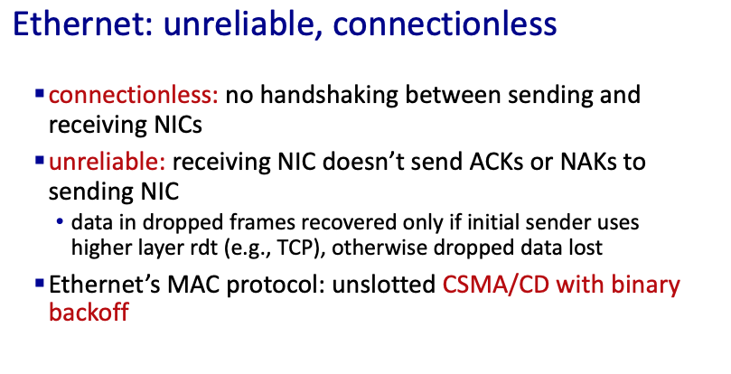

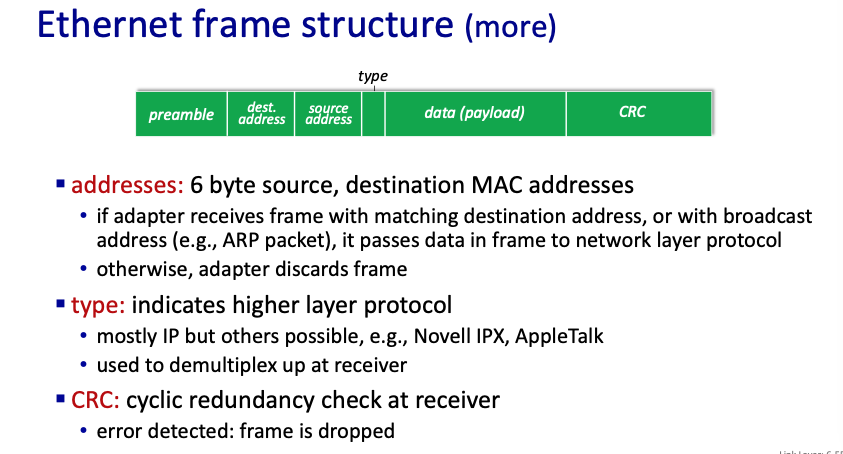

### Switch

### VLANs

## 6.5 Link Virtualization: A Network as a Link Layer

畫圖？

## 6.6 Data Center Networking

跳過

## 6.7 Retrospective: A Day in the Life of a Web Page Request

跳過（建議自己看一下，或者哪天翻譯成中文）

## 6.8 Summary