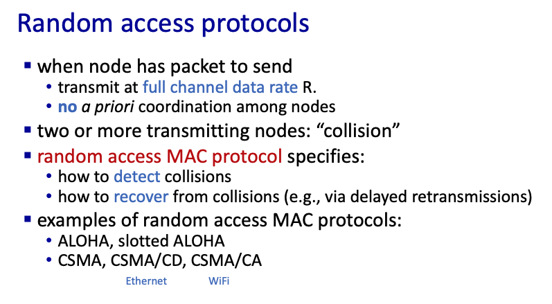
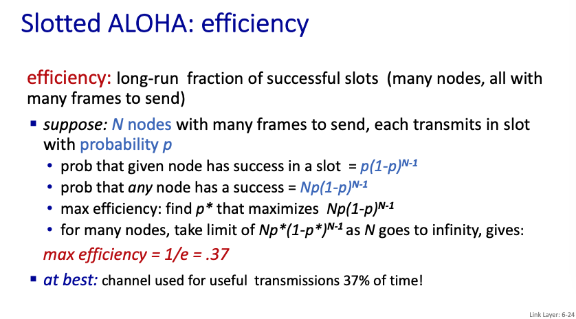

# Chapter 6 The Link Layer and LANs

## 6.1 Introduction to the Link Layer

第二層主要負責的是Broadcast能到的地方，例如把訊號發到銅線上面，所有在線上的機器都會收到訊號，為了避免所有的訊號混在一起等等的問題，因此有Layer 2 來協助這些事情。

## 6.2 Error-Detection and Correction Techniques

在Layer 2 中，出現的Noise特別容易出現，例如無線傳輸，你家的微波爐都可以干擾，因此在這一層會有一些error detection的機制

### Parity checking

以加法的方式來確定整個資料有沒有出錯，並且使用two-dimensional 的方式，還能夠偵測出哪個有出錯並且修正。

### CRC(Cyclic Redundancy Check)

他是一個更強的檢查方法，好了啦，能不能自己糾錯，我猜不行555

**Example**

我們這邊預設r = 3bit，所以G是r + 1 = 4 bit (G = 1001是查表，沒啥白痴意義)

在除法的時候，被除數後面補上r個0

除到最後會有三個數字，但預設要跟除數G一樣，所以得到的R會從011變成0011

最後我們把R塞在D的後面，

## 6.3 Multiple Access Links and Protocols

由於L2是在處理一個Broadcast頻道的問題，因此很現實的是，當一個網路環境之中有兩個以上的使用者要同時溝通要怎麼處理，以下有三個類型的處理方法：

**不同的種類**

### Channel partition

顧名思義，直接把時間或者是頻率分開，並且每個使用者只能用特定的頻段。

優缺點也很明顯，優點是不容易被干擾，缺點是使用者人數受限，還有資源浪費的問題

### taking turns

就是輪流的意思，可能用投票的方式決定誰來發送檔案，或者是傳遞token的方式

### Random access

人如其名，隨機來，也是目前多數Protocol所使用的

**Slotted ALOHA**

他把所有的時間段切成幾份，而在每一份的時間，每個使用者都有機率丟出一些東西

**Pure ALOHA**

直接不切時間了，大家想發送就發送，但效率比切時間差很多

**CSMA(carrier sense multiple access)**

本質上也是隨機傳送，只是在送之前會確定有沒有別人在送，有的話不會耍白目

其中的CD指的是會不會collision detection

儘管有張開耳朵，但可能會因為probergation delay的關係，還是有機率會撞到。

假如有CD，那偵測到錯誤之後，隔一個detect / abort time會停止傳送，如下圖

然後乙太網路用CSMA/CD，參考下圖

## 6.4 Switched Local Area Networks

**ARP protocol in action**

(簡報 42 ~ 44)

**Routing to another subnet: addressing**

(簡報 45 ~ 50)

### Ethernet

### Switch

### VLANs

## 6.5 Link Virtualization: A Network as a Link Layer

畫圖？

## 6.6 Data Center Networking

跳過

## 6.7 Retrospective: A Day in the Life of a Web Page Request

跳過（建議自己看一下，或者哪天翻譯成中文）

## 6.8 Summary