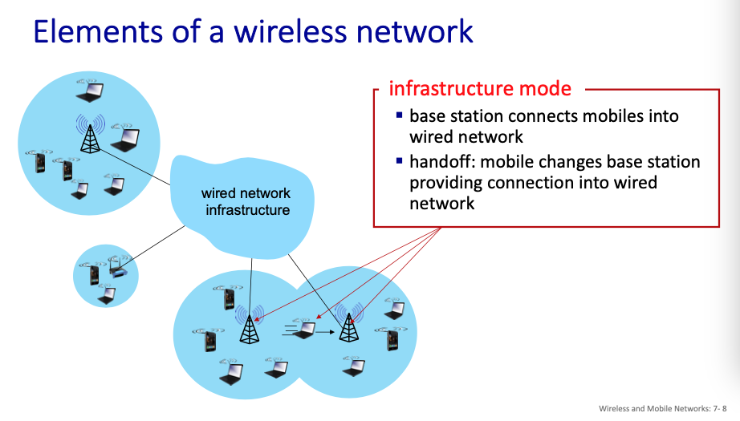
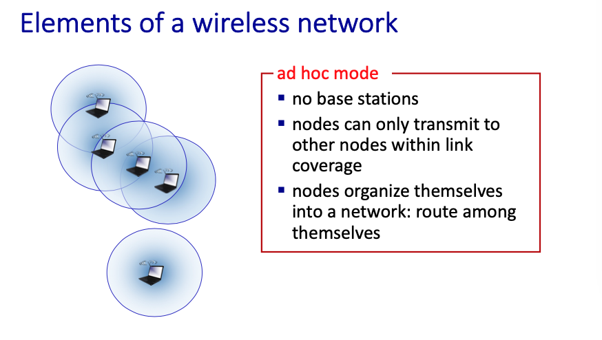
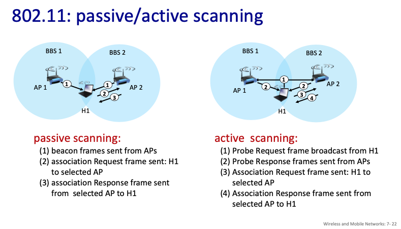
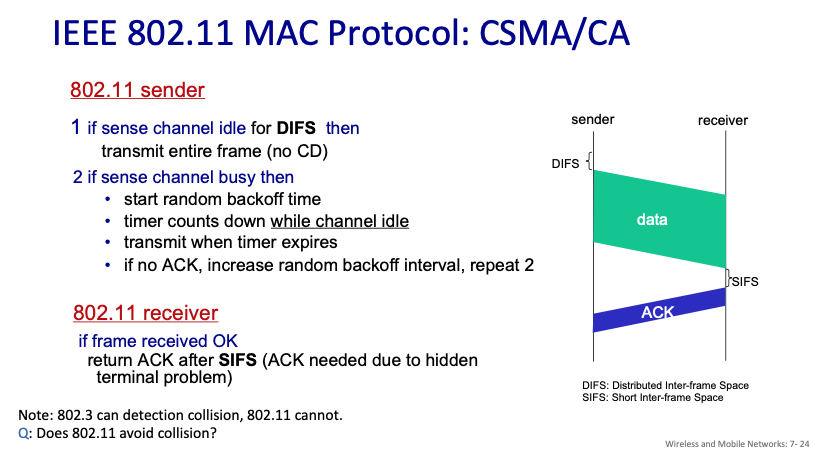
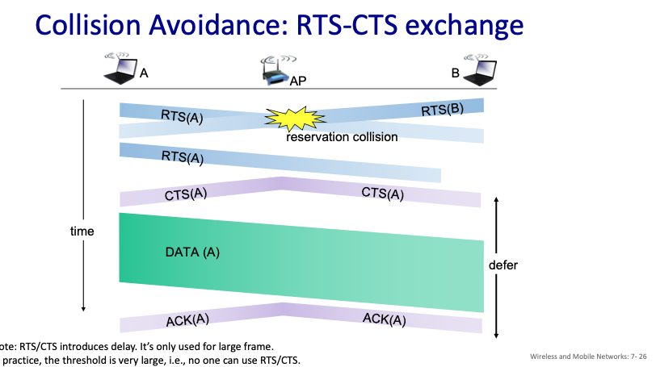
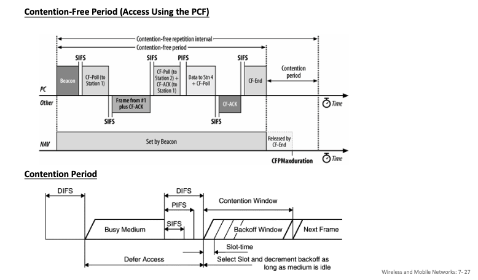
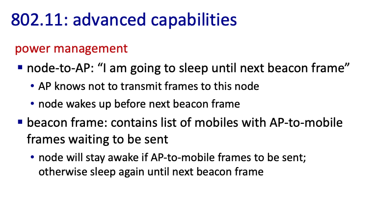
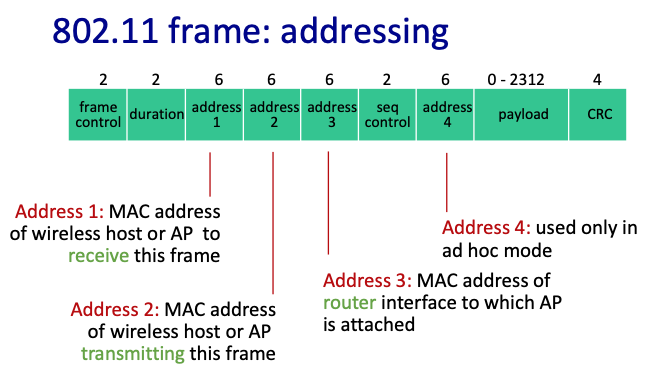
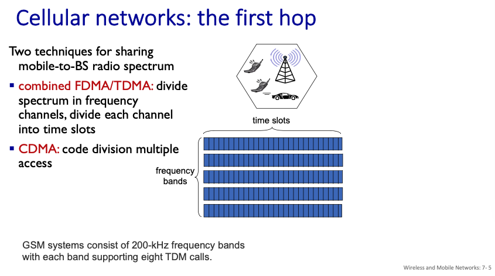
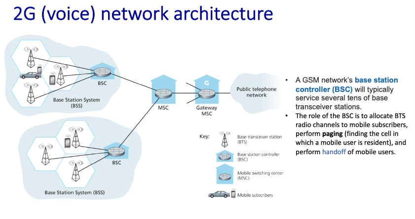

# Chapter 7 Wireless and Mobile Networks

## 7.1 Introduction

在上個章節我們討論過了Layer 2的機制，然而，我們只有討論有線的乙太網路，相對的干擾以及使用情境較為簡單單純，但在無線的世界裡有兩個挑戰要克服，首先是干擾，無線不只會被其他想傳輸的使用者干擾，甚至會被微波爐、藍芽等等東西干擾，還有物理屏障的挑戰;第二，要考慮『移動』這件事情，家裡的無線網路只需考慮小範圍的，但4G, 5G就要考慮在隨地都能收到網路，因此設計上要比實體下更多功夫。

**infrastructure mode** vs **ad hoc mode**

以下的ad hoc mode的場景是在一些沒有基礎設施的地方使用，例如戰場，來不及架基地台。

## 7.2 Wireless Links and Network Characteristics

以下是一些無線網路的不同與挑戰

以下這張圖主要解釋，有可能會有個訊號A在傳送，C也在傳送，但是兩個人確定訊號的時候都沒有聽到對方的訊號，因此當作沒問題繼續送，但是對於B來說，兩個人都在傳送資料，因此他收到一堆雜訊。

這個例子告訴我們，不能單純使用乙太網路的Protocol，剛剛的例子就算全部遵守，AC也會繼續傳送訊息。

### CDMA(Code Division Multiple Access)

與有線不同，無線因為有高機率會所有的東西都卡在一起(剛剛的例子有講)，因此要用encode, decode的方式，參考下圖，簡單來說，優點就是只要知道code是什麼，就算經過了一堆干擾，還是可以把東西給還原出來。

以下就是兩個人同時傳送，但是卡在一起，最後還是可以還原的例子

## 7.3 WiFi: 802.11 Wireless LANs

在Layer 3裡面，在同一個router底下的話我們會稱它為一個子網路，而在Layer 2裡面，在同一個AP(access point)裡面，我們會稱它在同一個BSS(basic service set, aka 'cell')，顯然他是instructure mode，並且會有自己的一個ID(通常會把它設定成跟mac address一樣)

在Layer 2裡面，只要網卡收到了AP的訊號的時候，就要做associate這件事情

**為什麼要associate?**

例如在2.4GHz的環境裡面，現實我們把他分為11個spectrum(避免互相干擾)，但AP只會在其中一個spectrum裡面定居，而你的網卡一開始會在11個channel裡面到處跳動（為了找到AP, 約0.1秒），那要怎麼知道有沒有找到呢？

AP會在自己的spectrum裡面不斷發送一個beacon，裡面包含了AP的SSID(AP's name, 例如載往路裡面看到nccu-wifi)還有MAC address

**802.11: passive/active scanning**

剛剛上面主要提到的都是passive scanning，也就是user端在每個channel裡面跳來跳去，並且收收看有沒有beacon被發出來

而active scanning是user端主動在每一個spectrum裡面發送訊號出去，要求host把資訊吐出來

> 小知識：可以設定AP不會送beacon出來

**multiple access**

上面我們提過，無線沒有辦法使用collision detection，因此CSMA/CD不能用，因此改用CSMA/*CA*(CollisionAvoidance)

802.11的步驟：

1. sender DIFS時間：聽一下有沒有人在傳送東西，
2. sender 直接傳送資料（在一段時間）
3. sender 丟骰子，決定下一個時間要不要傳送東西
4. receiver 等待一個SIFS(所有protocol裡面最短的)，回覆一個ack

為什麼要丟骰子
> 因為假如有一堆人

為什麼SIFS要比DIFS小？
> 因為那個ACK要在其他人傳資料之前就收到

*RTS-CTS:*

idea: 因為沒有辦法避免collision發生，因此回歸到類似投票之類的方法

1. sender們隨機送RTS給AP
2. AP發送CTS，並在裡面指定一個user，代表他得到了傳送的全縣
3. 那個user收到了，並且瘋狂傳資料

實務上預設被關掉了

實際上的wifi運作：

這個圖是在描述實際上的wifi是這麼做的，不要競爭

最後使用了類似pulling的方式

省電對於網卡的重要性：

wifi封包結構：

裡面有四個address

1. dest address
2. source address
3. 好像是經過AP的時候會出一點問題，所以要另外指定另一個mac address的樣子[p 29]
4. 沒用

**Bluetooth**

老師說不要理他

## 7.4 Cellular Networks: 4G and 5G

換到7_2的頭影片

4G/5G想把電話無線化，最大的挑戰是motability，也就是換到另一個基地台的時候，網路基本上都還在，但理論上，切換基地台的時候，Layer 2一換掉，上面的Layer3,4,7都會斷掉，IP也不一樣了

**1G**

超大黑金剛年代

兩個重要技術

1. conbined FDMA/TDMA
2. CDMA

**2G(voice)**

19xx年，疊床架屋

一個BSC(base station controller)控制好多個Tower，又稱為BTS(base transceiver station)˙

到了後期，就算有傳送簡訊的服務，也只是把文字轉成語音，接著把東西變成聲音，接著再變成文字

handoff: 切換tower的過程，細節還沒講

**3G**

## 7.5 Mobility Management: Principles

## 7.6 Mobility Management in Practice

## 7.7 Wireless and Mobility: Impact on Higher-Layer Protocols

## 7.7 Wireless and Mobility: Impact on Higher-Layer Protocols