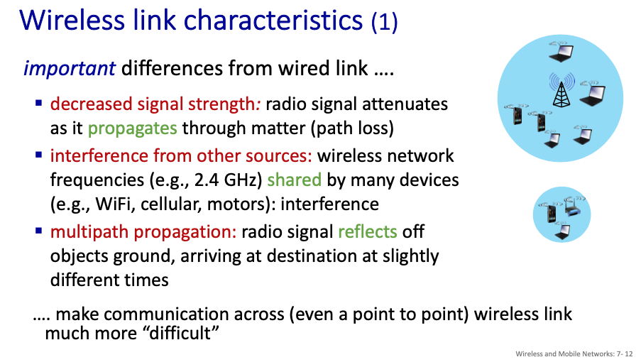
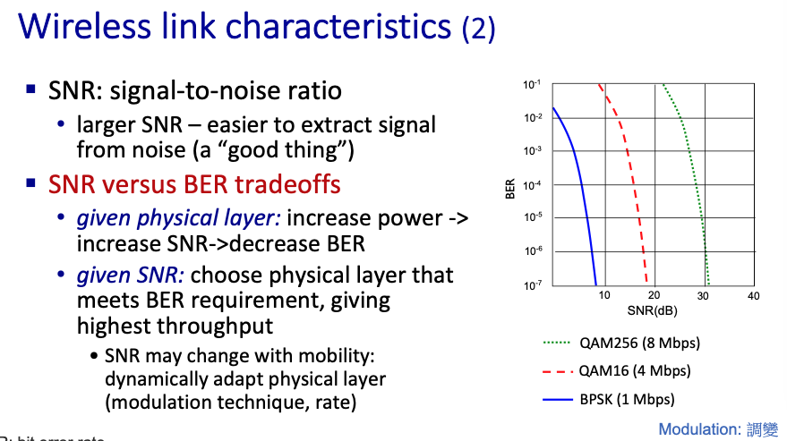
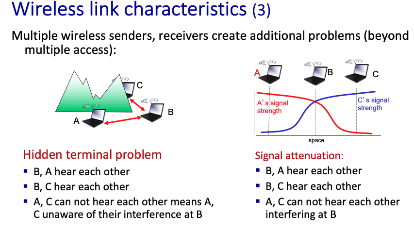
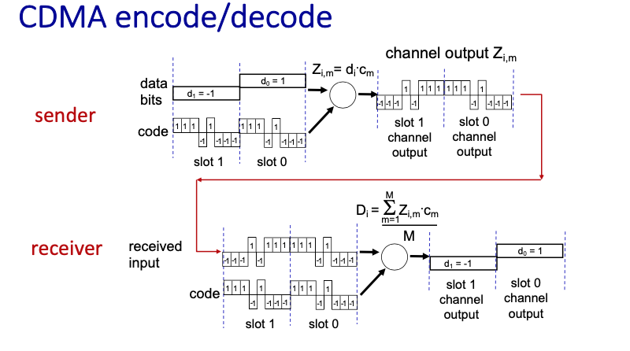
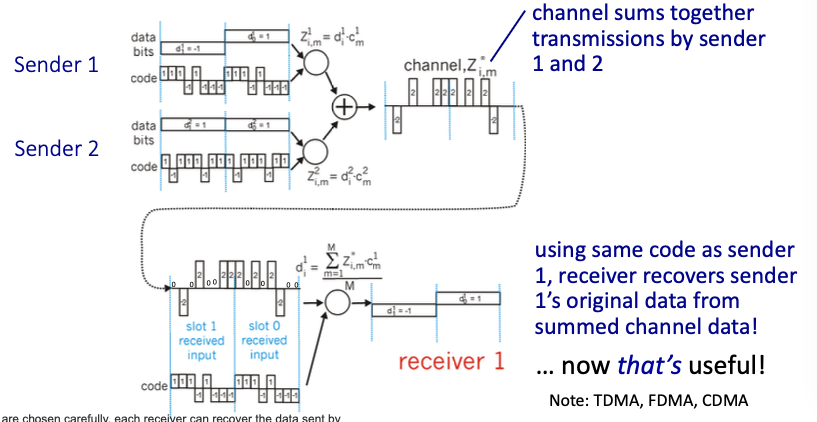

# Chapter 7 Wireless and Mobile Networks

## 7.1 Introduction

**infrastructure mode** vs **ad hoc mode**

## 7.2 Wireless Links and Network Characteristics

### CDMA(Code Division Multiple Access)

## 7.3 WiFi: 802.11 Wireless LANs

## 7.4 Cellular Networks: 4G and 5G

## 7.5 Mobility Management: Principles

## 7.6 Mobility Management in Practice

## 7.7 Wireless and Mobility: Impact on Higher-Layer Protocols

## 7.7 Wireless and Mobility: Impact on Higher-Layer Protocols