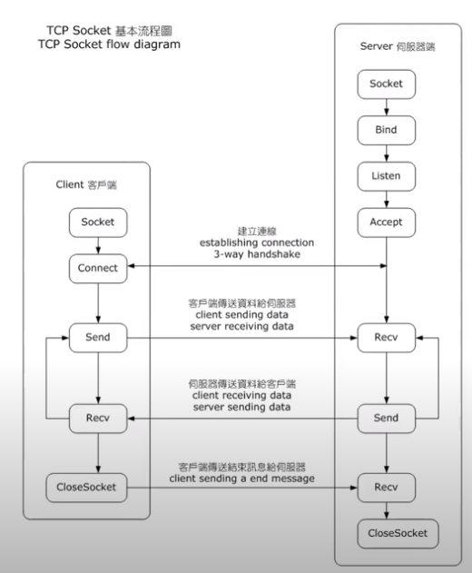

# AS01

## Introduction

1983年的時候，美國柏克萊大學研究者，使用Unix作業系統發展一套函示庫，以API的形式，讓使用者可以方便呼叫函式庫，來寫跨網路的程式，也就是IPC(inter-process communication)，使用Berkeley socket 是公認最基礎的方法，因此每一個作業系統中都會內建Berkeley Socket 或是他的延伸版本，例如windows 利用 Windows API 函式庫中的 winsock2.h 函式庫的標頭檔案，用來提供 socket 的服務，而Linux 則是內建的 sys/socket.h 這個標頭檔案來讓你撰寫 socket 程式

不過可能會用其他的高階語言寫服務，通常他們的函式庫，有更高階的API讓我們更方便的寫網路的程式，不過底層還是會用到Berkeley Socket，以下是最基本的Berkeley Socket 函式庫

## Socket 範例

[Client Socket](https://github.com/hsiaom26/Socket/blob/master/TCP_Socket_Server.ipynb)

[Server](https://github.com/hsiaom26/Socket/blob/master/TCP_Socket_Client.ipynb)

主要要達成的幾個點：
- run at TCP port 8888 on 127.0.0.1 IP address
- implement persistent HTTP at most two objects in a single TCP connection
- multi-thread HTTP server
- GET good.html
- GET style.css (Context-Type  be text/css)
- GET redirect.html --> 301 Moved Permanently, Location:localhost:8888/good.html
- GET notfound.html --> 404 Not Found 

小記錄：
1. HTML response 的結構要注意，放data之前要有'\r\n'這一行，沒加對面認不出來後面是資料
2. 傳輸是用byte-like data, 因此要處理或者輸出的時候記得轉型態
3. data send 完之後，記得要把socket close，不然會出問題。

source code:
~~~python
import socket
import threading

#file area
html = '<html><head><link href="style.css" rel="stylesheet" type = "text/css"></head><body>good</body></html>'
css = 'Body{color:red;}'

#response message area, when server receive different type of request, it will call
#this funciton to create the respectively message to client
def respM(number,obj):
    message = 'HTTP/1.1 '+ str(number)
    if number == 200:
        message += ' OK\n '
        if obj == 'html':
            message += 'Content-Type: text/html\n\r\n' + html
        if obj == 'css':
            message += 'Context-Type: text/css\n\r\n' + css
    elif number == 301:
        message += ' Moved Permanently\nLocation: http://127.0.0.1:8888/good.html\n\r\n'
    elif number == 404:
        message += ' Not Found\n\r\n'
    return message

# create socket and set port
s = socket.socket(socket.AF_INET, socket.SOCK_STREAM)
pars = ('127.0.0.1', 8888) # you can change the server port to whatever you want
s.bind(pars)
s.listen(5)

# a thread serve the client
def serveClient(clientsocket, address):
    
    # we need a loop to continuously receive messages from the client
    while True:
        data = clientsocket.recv(1024)
        print("from client", data)
        
        # if the received data is not empty, then we send something back by using send() function
        if data:
            # change the byte-like data to string first, and use str.split to identify the 
            # messenge of the user
            newData = data.decode("utf-8").split(' ')
            method = newData[0]
            url = newData[1]
            # check what user want to get, and create the respective response message to client
            # by resM function, and turn it to byte-like data and send to client
            if url == '/good.html':
                resp = respM(200,'html')
                clientsocket.send(bytes(resp,'UTF-8'))
            elif url == '/style.css':
                resp = respM(200,'css')
                clientsocket.send(bytes(resp,'UTF-8'))
            elif url == '/redirect.html':
                resp = respM(301,'0')
                clientsocket.send(bytes(resp,'UTF-8'))
            elif url == '/notfound.html':
                resp = respM(404,'0')
                clientsocket.send(bytes(resp,'UTF-8'))
            else:
               resp = respM(404,'0')
               clientsocket.send(bytes(resp,'UTF-8')) 
            # after send the data, close the socket
            clientsocket.close()
            break
        

while True:
    (clientsocket, address) = s.accept()
    threading.Thread(target = serveClient, args = (clientsocket, address)).start()
~~~
