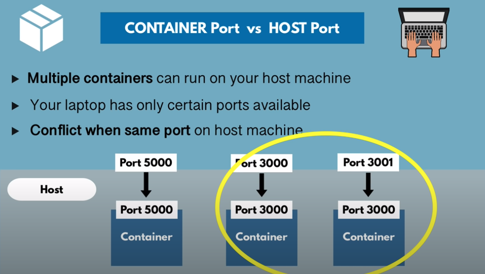

# Docker 教學

## 簡介

Docker 就是一個可以把程式專案打包起來的東西，特別之處就是把整個library都包起來了，所以不會有執行的問題

## 快問快答

**What is a Container?**
- Mostly Linux Base Image, because small in size
- Application image on top

其中包含
- port binded
- appplication image
- virtual file system

**Advantage of Layer Structure**
- 兩個不同Container，可以下載Layer不同的地方就好

**Docker Image vs Docker Container**
Container is a running environment for image

|Docker Image|Docker Container|
|-|-|
|the actual package|actually start the application|
|artifact, that can be moved around|-|
|not running|running|

**Docker vs VM**

|Docker|VM|
|-|-|
|Application|Application|
|-|OS Kernal|

Advantage in Docker

1. Size
2. Speed
3. Compatibility

**Container Port vs Host Port**

要這樣做port的分配，就要在run的時候指定電腦port和container port

~~~docker
docker run -p [local port]:[container port]
~~~

## 安裝

## 常見錯誤（讓未來更方便）

## Docker Network

可以把兩個container放在一樣的token network, 兩個container就可以藉由container name互相溝通

### 指令區

~~~docker
docker network ls                     #列出所有docker網路
docker network create [networkName]   #建立一個新docker網路
docker run --net [networkName]        #建立container時指定在哪個網路裡面
~~~

## Docker Compose

假如原本要建立三個Container，設定好一些參數之後並且互相溝通，那我們原本要先分別打建立的程式碼、設定好port, env之類的，接著要把所有Container放在同一個網路裡面，Docker Compose就是解決了這種不方便的地方。

首先，docker compose 有個yaml檔案，裡面有一些資訊

~~~docker
version:'3'     #docker compose 的版本
services:       #記錄有哪些container
  mongodb:      #其中的一個container
    image:monge #container
    ports:
      -27017:2u017  #對應到 -p 27017:27017
    environment:
      -MONGO...     #對應到 -e MONGO...
    ...
  monge-express:
    image:mongo-express
~~~

### 開始使用Docker Compose
~~~docker
docker-compose -f [ymal file] up    #其中-f代表指定file，up代表啟動所有在ymal的container
docker-compose -f [ymal file] down  #跟up相反
~~~

## Docker file
用來建立自己的image用

## 常用指令

**新手上路**

~~~docker
docker search [IMAGE wnat to search] # 找找酷酷docker
docker pull [IMAGE want to download] # 把docker下載下來
docker image    #察看目前所有image*
docker ps       #察看目前運行的container(想看全部加上 -a)*
~~~
**新建Container(有名字的那種，ubuntu image 在run要加上-it)**

其中，run是『建立』一個container，start是啟動一個沒在動的container

~~~docker
docker run -it --name [ContainerName] [IMAGE] 

# 透過 iamge 執行並產生一個新的 container
$ docker run [Image 名稱]:[Image 版本] [執行指令]

# ex:
$ docker run hello-world
$ docker run ubuntu /bin/echo "example 1 - ubuntu"
$ docker run ubuntu:14.04 /bin/echo "example 2 - ubuntu:14.04"

########### 我是分隔線 ###########

# [OPTIONS]:
# -i, --interactive (互動模式)
# -t, --tty         (配置一個終端機)
# -d, --detach      (在背景執行)

$ docker run [OPTIONS] [Image 名稱]:[Image 版本] [執行指令]

# ex:
$ docker run -i -t ubuntu:14.04 bash
$ exit
~~~
**啟動有的沒的(ubuntu image要在run的時候加上-it才不會爆炸)**
~~~docker
docker start [ContainerName]                #啟動container
docker exec -it [ContainerName] [Command]   #進入container #通常command 輸入 /bin/bash
docker stop [ContainerName]                 #關掉Container
docker rm [ContainerName]                   #刪除Container
~~~

## 參考資料
1. [Docker](https://github.com/twtrubiks/docker-tutorial)
2. [合併Docker-Dockerfile](https://ithelp.ithome.com.tw/articles/10187192)
3. [Docker 影片教學](https://www.youtube.com/watch?v=3c-iBn73dDE&ab_channel=TechWorldwithNana)
