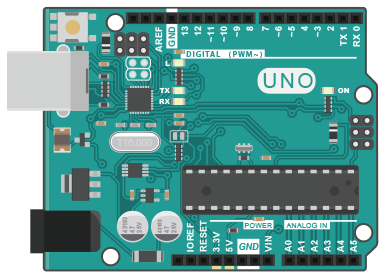
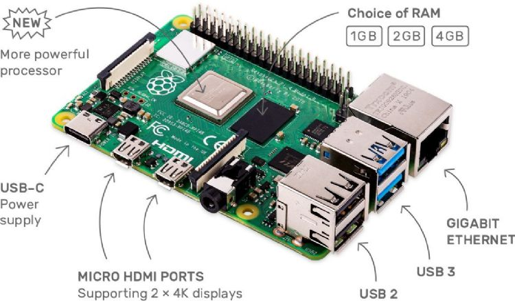

# Maker

## 基本介紹

**什麼是Maker？**
引言來自維基百科

> 自造者（英語：Maker，又譯為「創客」）概念來源於英文Maker和Hacker兩詞的綜合釋義，它是指一群酷愛科技、熱衷實踐的人群，他們以分享技術、交流思想為樂，以自造者為主體的社區（Makerspace）則成了自造者文化的載體。

而其中，DIY也含蓋在這個概念中，創課喜歡『自己』造出與時代多數產物不統、古怪但有特色加上自己想法的發明。

[自造者特點的內涵](https://zh.wikipedia.org/zh-tw/%E5%88%9B%E5%AE%A2)

**有什麼樣具體的特色呢？**
1. DIY、有個實體成品
2. 電路、機械、金屬加工......當作手段
3. 創新為主，在成品融入自己的想法為重，商業化等等較為其次
4. 分享與交流

**為何近年才興起類似風潮？**
機械、電子電路、程式等等工具其實早就被發明了，但在早期這是一件非常「專業」的事情，不論是在「技術」或者是「經濟」成本都非常的高，並不是所有人都可以嘗試用這些工具開發，然而到了現在，你不需要了解非常多的計算機組織、作業系統等等，你還是能利用程式來做自己的事情，電子電路、機械等等也因為網路資源的關係大大降低學習門檻，不用一定要到特定科系或者是特定職業才能去學到專業的知識

## 常用的手段與應用
1. 手工、現成材料 [胡子](https://www.youtube.com/watch?v=wmNKPll9HWI&ab_channel=%E8%83%A1%E5%AD%90Huzi)
2. 木工、雷射切割、金屬加工 等等 [黃小潔](https://www.youtube.com/watch?v=-W5PvsGdamU)
3. 程式＋簡單的電子電路 [分手燈](https://tw.news.yahoo.com/%E5%96%AE%E8%BA%AB%E7%8B%97%E8%B2%B7%E8%B5%B7%E4%BE%86-%E5%88%86%E6%89%8B%E9%80%9A%E7%9F%A5%E7%87%88-%E8%B6%85%E7%99%82%E7%99%92-054508541.html?guce_referrer=aHR0cHM6Ly93d3cuZ29vZ2xlLmNvbS8&guce_referrer_sig=AQAAAJBSOoYVNy1Qkt4je7WEZNnkMTuVxWVeUtjm28gHWPqhFiztHZiTt-fN49Mw344OO7UfMidI2Ixb4hItCKTea_zbYB1Oa8lGvuP3Br-eknNr3tJqjGohoOxc4Ia0cWsiLAtlLc1CwiOc1hbKNAopMZifxUW-zGIOurFPyrcPUg0p)
4. 也不知道反正就很強 [稚暉君](https://www.youtube.com/watch?v=kCL2d7wZjU8&ab_channel=%E7%A8%9A%E6%99%96%E5%90%9B)
## Arduino

**什麼是Arduino**
他是一個酷酷的單版為控制器，也就是一塊可以控制電路的小電腦

基本上是以C當作主要的程式語言，然後進行一些控制有的沒的，有興趣網路很多介紹影片，我們這邊不是那樣的地方

**Arduino 重要在哪？**
> 在Arduino 出現之前，若是想做個自動控制的設備，像是要控制一些感測器或是透過繼電器控制家電，大家想到的就是單晶片、8051，這時就必須深入了解單晶片的程設設計，除了程式難度較高，所需的設備成本也高出許多

**Arduino常看到的用途**
懶得找，給大家看影片

[常用模組](https://www.youtube.com/watch?v=hvAXQjebDX4)
[小朋友發明](https://youtu.be/j1Nx0rJfLyM)

**那Arduino跟Maker有什麼關係？**
基本上Arduino是讓你學一點程式和一點點電路結構互相結合的一個媒介，他省去了你需要做很多專業研究門檻，但可以讓你馬上感受到自己把東西刻出來的快感。

## 樹梅派

**什麼是樹梅派**
> Raspberry Pi 是由劍橋大學的 Eben Upton 及其他幾位老師所設計的，最初只是為了提供一台平價的電腦和自由軟體，讓學生可以輕鬆取得，用來學習跟練習電腦科學的相關知識。

一樣，他擺在這個章節，就代表他可以跟一些電子電路串在一起，讓你可以實現一些酷酷的事情
**那他跟Arduino有什麼差別**
他有作業系統

或許你會很疑惑，有作業系統會怎麼樣，但簡單來說就是兩個不同的世界，一個是你要多去了解它要怎麼把程式弄進去等等的，但是在樹梅派裡面，他就跟你的電腦一樣。

當然，因為要把作業系統塞進去，硬體相對就需要強一點，理所當然他就會比較貴，所以要如何挑選這兩個不同的機器，就看你的實做預算考量，再挑選最適合你的機器

## 達賢圖書館的資源

## 台灣的實體活動

## 參考資料
1. [維基百科-自造者](https://zh.wikipedia.org/zh-tw/%E5%88%9B%E5%AE%A2)
2. [Taipei Makerfaire官網](https://taipei.makerfaire.com/)
3. [關於創課教育](https://mindduo.benq.com/maker_education/)
4. [2022創客嘉年華](https://n.yam.com/Article/20221026315953)
5. [傑森創工 - Arduino](https://blog.jmaker.com.tw/arduino-tutorials-1/)
6. [IT 技術家 - 樹梅派](http://blog.itist.tw/p/how-to-study-raspberry-pi.html)