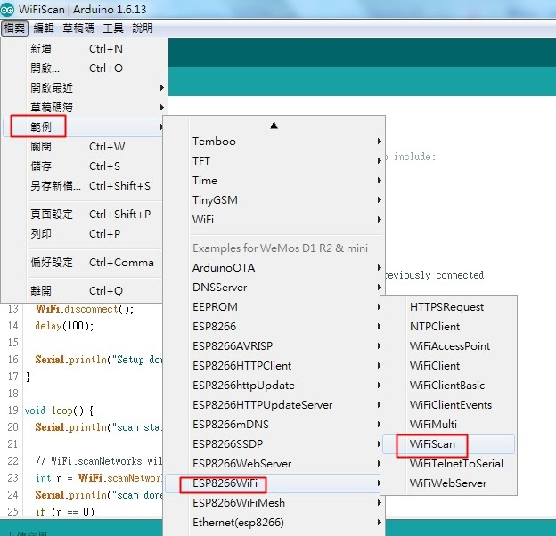

# ESP8266開發設定

## 基礎設定

在Arduino IDE設定環境，主要參考[這篇](https://sites.google.com/site/arduinochutiyan/home/nodemcu/arduino-%E7%92%B0%E5%A2%83%E5%BB%BA%E7%BD%AE-%E5%AE%89%E8%A3%9Desp8266%E9%96%8B%E7%99%BC%E6%9D%BF)

> 也可以順便設定一下[黑暗主題](https://github.com/jeffThompson/DarkArduinoTheme)

網址使用：http://arduino.esp8266.com/stable/package_esp8266com_index.json

開發版管理員選擇：LOLIN(WeMos)D1R1

測試程式碼
~~~Arduino
void setup(){
  Serial.begin(9600); // send and receive at 9600 baud
}

int number = 0;

void loop(){
  Serial.print("The number is ");
  Serial.println(number);    // print the number

  delay(500); // delay half second between numbers
  number++; // to the next number
}
~~~

還可以用預設的程式碼去看基礎功能：

## LED 測試區

常用程式碼：
~~~Arduino
// 在setup那邊就要設定這個孔要輸入還是輸出，前面是位置，LED通常是OUTPUT
pinMode(LED_BUILTIN, OUTPUT);

// 寫入高電位或低電位
digitalWrite(D13, 0);

// 延遲一下
delay(1000);
~~~

**常用代號**
LED_BUILTIN：預設的燈，在晶片旁邊
D1~D13：就是那個孔

## Input 區域

**按鈕**

參考資料：https://blog.jmaker.com.tw/arduino-buttons/

假如要使用Digital Read，那就要來個上拉電阻，或是使用
~~~Arduino
pinMode(BUTTON_PIN, INPUT_PULLUP); //設定按鈕的接腳為輸入，因為我們要讀取它的狀態
~~~

## 三用電表

教學：https://www.youtube.com/watch?v=Dvg1X1q7kQs&t=3s

