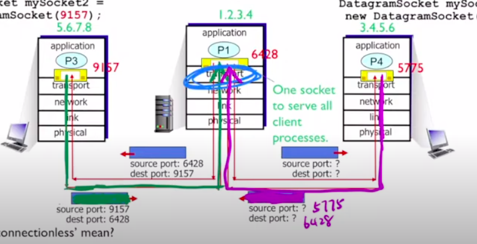
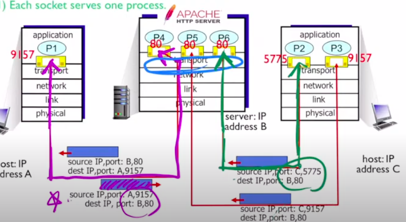
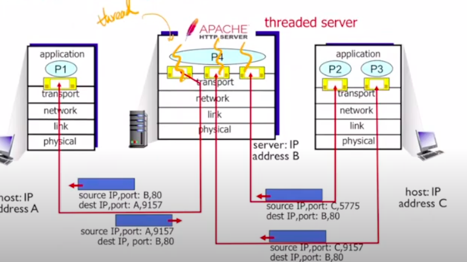

# Chapter 3. Transport Layer

## 3.1 Introduction and Transpost-Layer Services

### 3.1.1 Relationship Between Transport and Network Layers

### 3.1.2 Overview of the Transport Layer in the Internet

TCP(Transmission Control Protocol) 是 Reliable 的
UDP(User Datagram Protocol) 什麼鬼都沒有

## 3.2 Multiplexing and Demutiplexing
觀察程式之間怎麼丟檔案：觀察封包Header，Header前面的Source port 還有dest port，各自16bit，合起來吃了32bit的大小。

**Connectionless Demultiplexing**
> 1. 當建立一個socket的時候，一定要指定一個port number(自己的)
> 2. 建立datagram的時候，要有目標的ip address和port
> 3. 確認segement的destination port number
> 4. 只要有同一個dest port和dest ip,就會給同一個socket吃到

**Connection-orented demultiplexing**
> sourceID,sourcePort,destIP,destPort 一個不一樣就會有新的socket

然而以前這樣開很多Socket會耗很多資源，新的方法是用thread

## 3.3 Connectionless Transport: UDP
基本上很簡單，因為只要管理自己的東西就好

**UDP的優點**
1. OS不需要先建立連結，省一個RTT
2. 不用維持statue
3. header size小

### 3.3.1 UDP Segment Structure
就header，header裡面有這些

1. source port number
2. dest port number
3. length：整個segment的長度(包含header(至少8))
4. checksum

### 3.3.2 UDP Checksum

知道整個封包有沒有錯（注意：沒有要復原的意思，就知道錯而已）
把整個segement以16bit為單位切成一格，把大家都加起來變成一個sum 
checksum的算法就是把sum的01翻過來 
假如reciver發現有錯，那就會把封包丟掉，沒錯就會接收

## 3.4 Principles of Reliable Data Transfer
因為網路是個不穩定的環境，所以要盡量控制那個錯誤，那就是reliable data transfer protocol

要注意圖片裡面的called from above和called from below

**Finite state machine(FSM)**

### 3.4.1 Building a Reliable Data Transfer Protocol

### 3.4.2 Prpelined Reliable Data Transfer Protocols

### 3.4.3 Go-Back-N (GBN)

### 3.4.4 Selective Repeat (SR)

## 3.5 Connection-Oriented Transport: TCP

### 3.5.1 The TCP Connection

### 3.5.2 TCP Segment Structure

### 3.5.3 Round-Trip Time Estimation and Timeout

### 3.5.4 Reliable Data Transfer

### 3.5.5 Flow Control

### 3.5.6 TCP Connection Management

## 3.6 Principles of Congestion Control Control

### 3.6.1 The Causes and the Costs of Congestion

### 3.6.2 Approaches to Congestion Control

## 3.7 TCP Congestion Control

### 3.7.1 Classic TCP Congestion Control

### 3.7.2 Network-Assisted Explicit Congestion Notification and Delayed-based Congestion Control

## 3.7.3 Fairness

## 3.8 Evolution of Transport-Layer Functionality

## 3.9 Summary