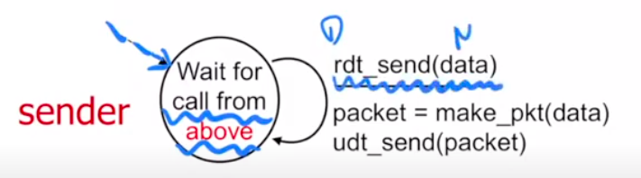

# Chapter 3. Transport Layer

## 3.1 Introduction and Transpost-Layer Services

### 3.1.1 Relationship Between Transport and Network Layers

### 3.1.2 Overview of the Transport Layer in the Internet

TCP(Transmission Control Protocol) 是 Reliable 的
UDP(User Datagram Protocol) 什麼鬼都沒有

## 3.2 Multiplexing and Demutiplexing
觀察程式之間怎麼丟檔案：觀察封包Header，Header前面的Source port 還有dest port，各自16bit，合起來吃了32bit的大小。

**Connectionless Demultiplexing**
> 1. 當建立一個socket的時候，一定要指定一個port number(自己的)
> 2. 建立datagram的時候，要有目標的ip address和port
> 3. 確認segement的destination port number
> 4. 只要有同一個dest port和dest ip,就會給同一個socket吃到

**Connection-orented demultiplexing**
> sourceID,sourcePort,destIP,destPort 一個不一樣就會有新的socket

然而以前這樣開很多Socket會耗很多資源，新的方法是用thread

## 3.3 Connectionless Transport: UDP
基本上很簡單，因為只要管理自己的東西就好

**UDP的優點**
1. OS不需要先建立連結，省一個RTT
2. 不用維持statue
3. header size小

### 3.3.1 UDP Segment Structure
就header，header裡面有這些

1. source port number
2. dest port number
3. length：整個segment的長度(包含header(至少8))
4. checksum

### 3.3.2 UDP Checksum

知道整個封包有沒有錯（注意：沒有要復原的意思，就知道錯而已）
把整個segement以16bit為單位切成一格，把大家都加起來變成一個sum 
checksum的算法就是把sum的01翻過來 
假如reciver發現有錯，那就會把封包丟掉，沒錯就會接收

## 3.4 Principles of Reliable Data Transfer
因為網路是個不穩定的環境，所以要盡量控制那個錯誤，那就是reliable data transfer protocol

要注意圖片裡面的called from above和called from below

**Finite state machine(FSM)**

假如一個系統很龐大，你不能直接用直覺判斷每個程序執行到什麼階段，因此用狀態來判別整個系統執行到那裡，例如在販賣機裡面，使用者投錢下去那飲料就該顯示投入金額和可買飲料

而每個狀態到每個狀態之間要分別標示event和action，而event是觸發action的條件

而在規劃FSM的時候，可以畫表格來確定系統裡面會有哪些event，再化成上面圖片的樣子。

> 在畫表格的時候，假如看到state之間沒有event，還是可以思考一下系統會不會出現一些bug，可以多一點catch throw 的空間
### 3.4.1 Building a Reliable Data Transfer Protocol
**RDT 1.0**

假設：no bit error,no loss of packets 
| sender的FSM | receiver的FSM |
|---|---|
|||
|等call from above, 之後就把封包裝一裝，就丟出去，再等第二個封包|等 call from below, 接著拆封包|

**RDT 2.0**

假設：channel with bit errors 
特色：reciever 要通知sender說他送錯了，請再送一次
- acknowledgements(ACKs): reciver告訴sender傳好的
- negative acknowledgements(NAKs): receiver 告訴sender傳的有error

1. sender的FSM      Sender 一樣在call from above的狀態，收到訊息之後，要先算出checksum讓sender可以偵測error，接著把封包丟過去，接著進到wait for ack 的狀態，假如收到成功就結束了，等待下一個call from above. 假如失敗了，那就再送一次，然後再回到wait for ack.
2. receiver的FSM     receiver一直在wait for call from below，接到東西之後開始確定有沒有問題，假如沒問題就多送一個ack過去，失敗的話就回傳，回傳過後一樣回到wait for call from below

> 有互相等待的機制就叫 step and wait

*萬無一失？*
假如送回去的ack或nak資料遺失怎麼辦（那個channel是不穩定地，會有bit error）

**RDT 2.1**
幫封包來個編號

重點：所有的封包都帶有checksum還有packet number，假如ack機制壞掉，receiver可以跟sender提醒他剛剛的東西收過了或者是沒收到

**RDT 2.2**

特色：不使用NAK 
那要用什麼呢？ACK加上錯誤的編號

**RDT 3.0**

問題：加上了loss 
現實情況：基本上只有sender知道有沒有到，因此請sender加上timer自行評估。

假設sender的timer已經到了，但其實ack有回來(duplicate ack)，但這樣D1還是會再送一次，因此ack的編號很重要，不然會搞錯。 

*Performance*

效率極差，因為是stop-and-wait 
3.0可以用，但是可以溝通

### 3.4.2 Pipelined Reliable Data Transfer Protocols

簡單來說就是一次送一大堆過去，一次收到有多少封包出問題，接著再一次送過去。

### 3.4.3 Go-Back-N (GBN)
**Sender**

基本上就是依照記憶體的大小先給一個window，代表是隨時準備要傳出去了，那個windows裡面包含兩個部分，也就是sent, not yet ack'ed和usable, not yet sent，而send_base指向第一個not yet ack'ed，nextseqnum指向第一個not yet sent，以下介紹兩個機制

1. clmulative ACK：假設目前的send_base指向9，但是receiver回傳11的ack，那這個演算法會將9 10 11都當作already ack'ed，並且send_base會指向12
2. timeout：假設目前的send_base指向9，nextseqnum指向20，如果發生timeout，那9~19都會一起再傳過去（timeout是以send_base為基準）。

**Receiver**

1. ACK-only：一次收到很多**連續**的封包，可以回報最高的那個就好(expected sequence number前一個)
2. expected sequence number：期待下一個來的封包序號
3. 注意，有可能封包來了，但是序號比你的expected number還要大(上圖紅色的地方)，那receiver該怎麼對這些數字比較大的封包呢？可以選擇丟掉或者留著都可以。

**GBN 的FSM**
(略過，有空補)

### 3.4.4 Selective Repeat (SR)
sender直接回報給receiver每個封包的狀況，沒有使用cumulated的機制，因此每個封包的timer都是各自獨立的

總整理

**A Dilemma**
假如編號編得不好，那可能會把錯誤的封包接在一起：例如總共有7個封包，分別編號1,2,3,4,1,2,3，假如receiver收到第二個封包後，收到了第七個封包，序號上來看是123沒問題，但實際上他跳過了很多封包

> 這個錯誤是理論上的，因為現實情況數字非常的大，所以不太會有超級跳號的情況發生

**比較**
在網路環境比較好的情況下，GBN比較好

## 3.5 Connection-Oriented Transport: TCP
Overview

MSS: maximum segement size, 不同作業系統大小設定不一樣（單位是byte）

### 3.5.1 The TCP Connection

### 3.5.2 TCP Segment Structure

**Head**
word = 32 bits
C,E:網路不好用
U:urgent
A:ACK
P:Push
R:Reset
S:Syn
F:Fin

### 3.5.3 Round-Trip Time Estimation and Timeout

### 3.5.4 Reliable Data Transfer

### 3.5.5 Flow Control

### 3.5.6 TCP Connection Management

## 3.6 Principles of Congestion Control Control

### 3.6.1 The Causes and the Costs of Congestion

### 3.6.2 Approaches to Congestion Control

## 3.7 TCP Congestion Control

### 3.7.1 Classic TCP Congestion Control

### 3.7.2 Network-Assisted Explicit Congestion Notification and Delayed-based Congestion Control

## 3.7.3 Fairness

## 3.8 Evolution of Transport-Layer Functionality

## 3.9 Summary